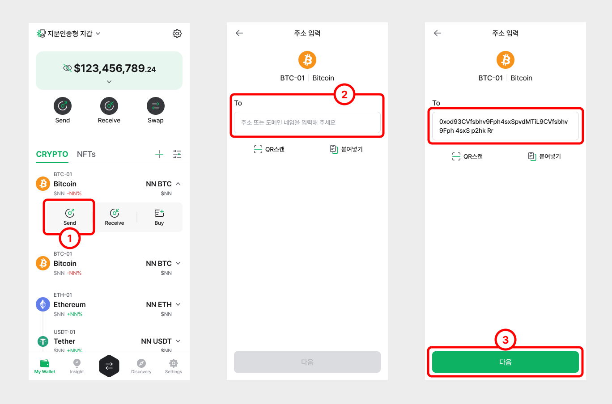
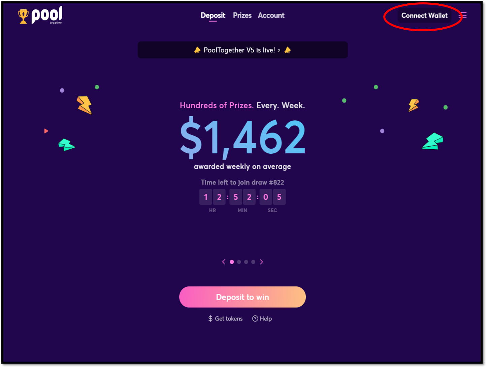

# Using Wallet Connect

D’CENT Mobile App has added support for [WalletConnect](https://walletconnect.org/). You can now connect and access your favorite DApps on PC or Mobile browser using D’CENT wallet addresses.

✅ Full list of DApps supporting WalletConnect can be found here: [https://walletconnect.org/apps](https://walletconnect.org/apps)

## What is WalletConnect?

WalletConnect is an open protocol for connecting DApps on your browser to mobile wallets using end-to-end encryption by scanning a QR code. This allows users to establish connections to websites (DApps) from a browser and carry out transactions securely from D’CENT Wallet without revealing any secret information to the internet.

## Using DApps on PC browser

In this example, we will access a DApp called **PoolTogether**. You will need your [D’CENT Mobile App](https://play.google.com/store/apps/details?id=com.kr.iotrust.dcent.wallet\&utm_source=dcentwallet\&utm_campaign=mobileapp) and PC to access the DApp website.

**Step 1)** Go to the [PoolTogether](https://app.pooltogether.com/) website from your browser and click on **Connect Wallet** button.

**Step 2)** Select **WalletConnect** from the list and you will get a **QR-Code**.&#x20;

**Step 3)** Launch your D’CENT Mobile App, and go to the **"Discovery"** tab. On the top of left corner is a QR-Code Scan icon. Click and scan the **QR-Code**.

After scanning the QR-Code, you will see the following request for connection, click **"Yes, I want"** button to connect your wallet address to PoolTogether DApp.

<figure><figcaption></figcaption></figure>

**Step 4)** When your D’CENT Wallet address is connected to PoolTogether DApp, you will see the following screens on your mobile and PC. Notice the D’CENT wallet address on the top right corner of the PoolTogether DApp.

**Step 5)** When you perform a transaction on the DApp service you are using, you will be prompted to confirm the transaction on the D’CENT Wallet.

**NOTE :** Make sure to keep D’CENT Wallet running on your mobile phone and stay on this activity. If you switch to other Apps, the current DApp (ie: PoolTogether) will lose connection and you will have to reconnect again.


Make sure to click on **disconnect** after when you finish using the DApp service.


## Using DApps on Mobile browser

**Step 1)** Go to the PoolTogether (App) website from your browser and click on **Connect Wallet** button.

**Step 2)** Select **WalletConnect** from the list.

**Step 3)** D’CENT Mobile App will be a selectable option when it is installed on your mobile phone. Select **D’CENT**.

**Step 4)** When D’CENT Wallet opens, **authenticate** to the access the Wallet App.

**Step 5)** Click **"Yes, I want"** button to confirm the request to connect Wallet Address to the DApp.

**Step 7)** Now your D’CENT Wallet address is connected to the DApp.

**Step 8)** When you perform a transaction on the DApp service you are using, you will be prompted to confirm the transaction on the D’CENT Wallet.


Make sure to click on **disconnect** after when you finish using the DApp service.


## Using DApps via D’CENT DApp browser (Discovery)

D’CENT Wallet has a built-in DApp browser, which supports connecting to DApps much easier by using **Web3 wallet (ie: D’CENT).** Advantage in using the built-in browser is that you only need to use a single application (D’CENT Wallet) to access a DApp service.

If the DApp service does not support the Web3 interface, you can select WalletConnect to establish connection to the DApp. Instructions are similar to the previous methods described in the sections above.\

