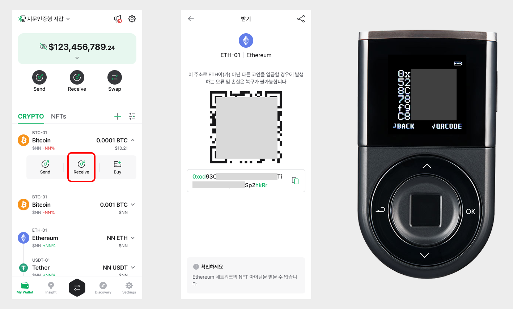

# 댑 브라우저 \(Discovery\)

디센트 모바일 앱에는 댑 브라우저가 탑재되어 있습니다. 댑 브라우저는 웹기반의 댑 서비스를 지갑과 연동하여 사용할 수 있는 기능입니다.

댑 브라우저를 통하여 메이커다오, 컴파운드, 유니스왑과 같은 **이더리움 기반의 댑**과 클레이스테이션과 같은 **클레이튼 기반의 댑** 서비스를 이용할 수 있습니다.

## 디스커버리 탭에서 댑 서비스 사용

앱 하단에 위치한 “**Discovery**” 탭에서 댑 서비스를 이용할 수 있습니다. 디센트 지갑과 연동하여 사용할 수 있는 서비스 목록이 있습니다. 서비스를 클릭하여 간단히 댑에 접속할 수 있습니다.

목록에 없는 댑 서비스는 **URL을 직접 입력하거나, 구글 검색**을 통해 접속할 수 있습니다.

## 지원 네트워크 목록

2021년 5월을 기준으로 현재 지원하는 블록체인 네트워크 기준은 다음과 같습니다. 앞으로도 다양한 블록체인 네트워크가 추가로 지원될 계획입니다.

댑 브라우저에서 네트워크를 선택하는 방법은 아래 링크를 참고하세요.



### 메인넷

* Ethereum
* Binance Smart Chain
* Polygon
* RSK
* Klaytn
* Tron

### 테스트넷

* Ethereum Testnet Ropsten
* Ethereum Testnet Rinkeby
* Ethereum Testnet Goerli
* Ethereum Testnet Kovan
* Binance Smart Chain Testnet
* Polygon Testnet Mumbai
* RSK Testnet
* Flare Testnet Coston2
* Klaytn Testnet Baobab
* Tron Testnet Shasta

## 서비스 목록

2020년 9월 현재 리스팅된 서비스 목록은 다음과 같습니다. 서비스에 대한 보다 명확한 내용은 각 서비스의 웹사이트를 참고하시는 것이 좋습니다.

* 문페이 \(MoonPay, [https://www.moonpay.io/](https://www.moonpay.io/)\) : 신용카드로 암호화폐를 구매할 수 있는 서비스
* 컴파운드 \(Compound, [https://compound.finance/](https://compound.finance/)\) : 암호화폐를 예치하고 이자를 받을 수 있는 서비스
* 메이커다오 오아시스 \(MakerDAO Oasis, [https://makerdao.com/](https://makerdao.com/)\) : 암호화폐를 담보로 스테이블 코인인 DAI를 대출 받을 수 있는 서비스
* 풀투게더 \(PoolTogether, [https://www.pooltogether.com/](https://www.pooltogether.com/)\) : 예치된 암호화폐의 이자를 모아 당첨자에게 몰아주는 서비스
* 유니스왑 \(Uniswap, [https://uniswap.org/](https://uniswap.org/)\) : 유동성 공급과 토큰 교환 서비스
* 1inch.exchange \([https://1inch.exchange/](https://1inch.exchange/)\) : 주요 DEX 거래소를 연결하여 토큰을 교환할 수 있는 서비스
* 오픈씨 \(OpenSea, [https://opensea.io/](https://opensea.io/)\) : 수집품, 게임 아이템, 디지털 아트와 같은 NFT를 사고 팔 수 있는 서비스
* 체인지나우 \(ChangeNOW, [https://changenow.io/](https://changenow.io/)\) : 암호화폐 교환 서비스
* 클레이스테이션 \(KLAYSTATION, [https://klaystation.io/](https://klaystation.io/)\) : 클레이튼 기반 KLAY 스테이킹 서비스

이 밖에도 다양한 서비스를 추가해 나갈 계획입니다. 

