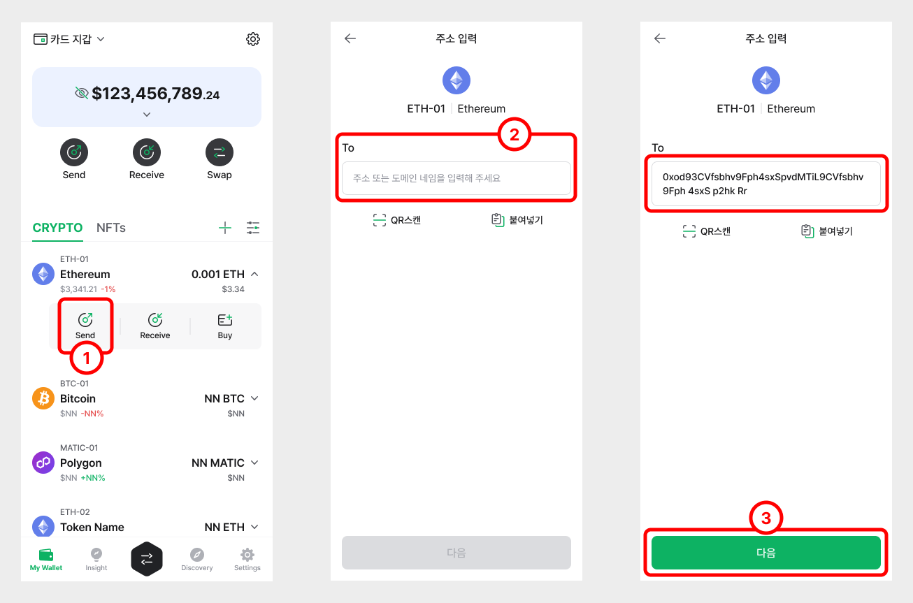
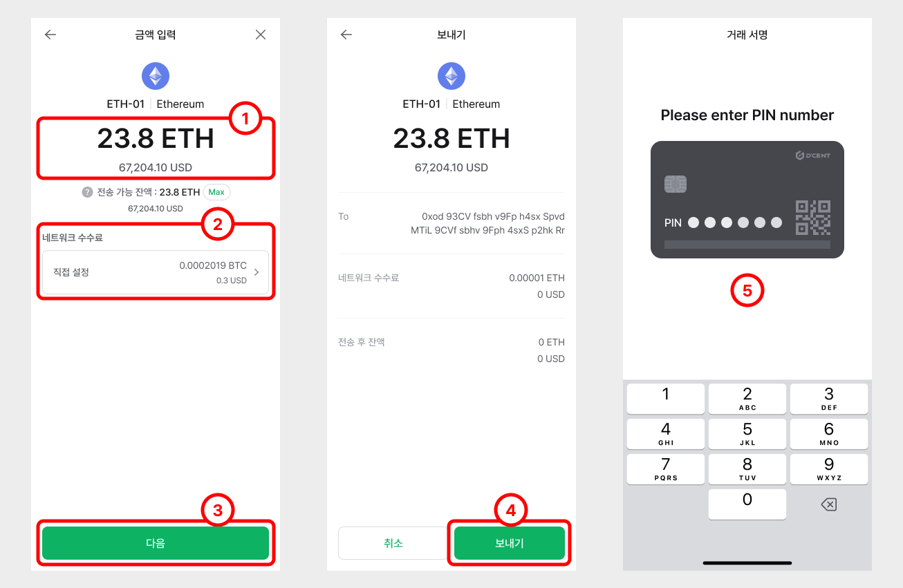
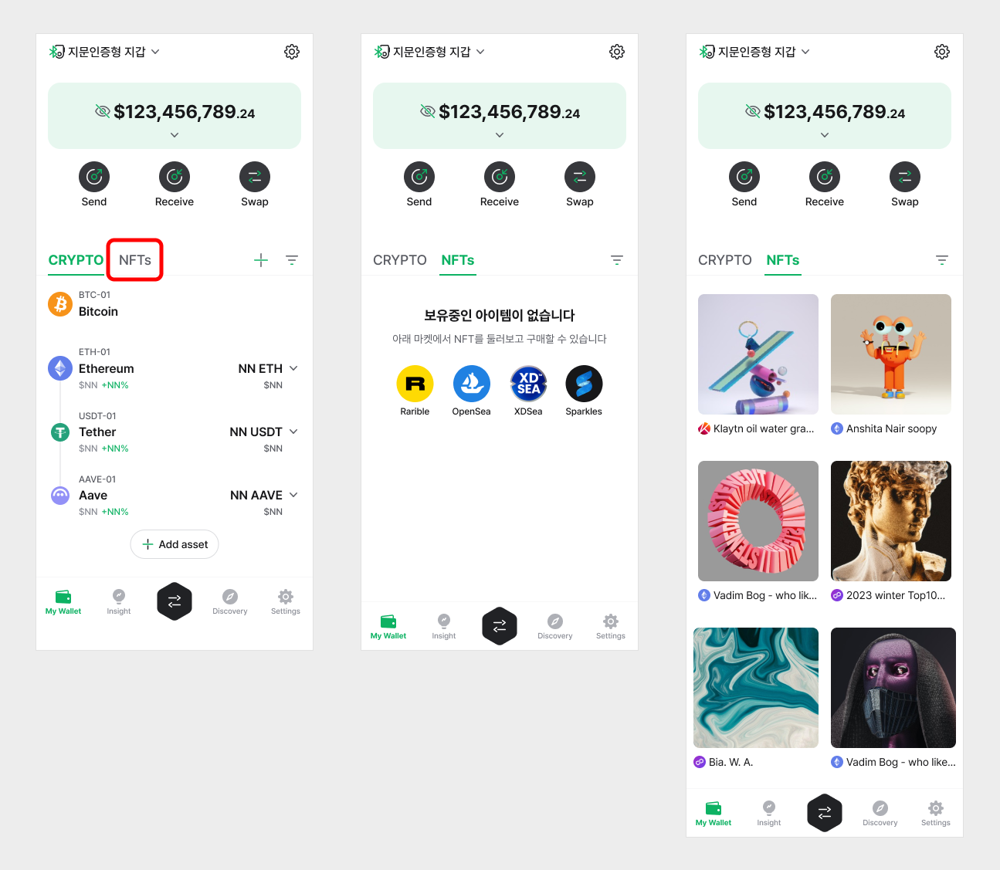

# Wallet Connect 사용법

디센트 모바일 앱에서는 WalletConnect를 지원합니다. PC 또는 모바일 브라우저에서 DApp에 연결할 때 디센트 지갑의 주소를 사용하여 서비스를 이용할 수 있습니다.

WalletConnect를 지원하는 DApp의 전체 목록은 여기에서 찾을 수 있습니다 : [https://walletconnect.org/apps](https://walletconnect.org/apps)

## WalletConnect는 무엇인가요?

WalletConnect는 QR 코드를 스캔을 사용하여 브라우저의 DApp을 모바일 지갑에 연결할때 end-to-end 암호화를 사용하는 개방형 프로토콜입니다. 사용자는 브라우저에서 웹 사이트 (DApp)에 연결하고 거래를 수행 할때는 디센트 지갑을 통해 승인을 요청할 수 있습니다. 이때 인터넷에 비밀 정보를 공개하지않고 안전하게 서비스를 사용할 수 있습니다.

## PC 브라우저에서 디센트 지갑을 DApps에 연결하는 방법

이번 예시에서는 PoolTogether라는 DApp에 액세스하는 방법을 소개해드립니다. DApp 웹 사이트에 접속하려면 디센트 모바일 앱과 PC가 필요합니다.

**Step 1)** 브라우저에서 PoolTogether 웹 사이트로 이동하여 **Account**를 클릭합니다.

**Step 2)** 사이트에서 **Connect Wallet** 버튼을 클릭합니다.

**Step 3)** 리스트에서 **WalletConnect** 를 선택하면 **QRCODE**가 표시됩니다.

**Step 4)** 핸드폰에서 디센트 모바일앱을 실행하고 ‘Discovery’ 탭으로 이동합니다. 상단 좌측 모서리에는 WalletConnect **스캔** icon이 있습니다. 아이콘을 클릭하고 QRCODE를 스캔합니다.

**Step 5)** QRCODE를 스캔하면 다음과 같이 승인 요청 화면이 표시됩니다. **OK**버튼을 클릭하면 PoolTogether DApp에 지갑 주소를 사용하여 연결됩니다.

**Step 6)** 디센트 지갑이 DApp 서비스에 연결되면 다음과 같은 화면을 디센트앱과 PC화면에서 표시됩니다. PoolTogether DApp에서 오른쪽 상단에는 서비스와 연결된 디센트 지갑 주소를 확인할 수 있습니다.

**Step 7)** DApp 서비스에서 거래를 진행하시는 경우 디센트 지갑으로 거래의 승인을 요청하게 됩니다.

**NOTE :** DApp을 사용중일 때는 디센트 모바일 앱을 항상 켜놓으시고 다른 앱을 사용하지 마시기 바랍니다. 다른 앱을 사용할 경우 현재 사용중인 DApp 서비스와 연결이 끊어질 수 있으므로 사용에 주의하시기 바랍니다. 연결이 끊어지면 다시 연결해야합니다.

## 모바일 브라우저에서 디센트 지갑을 DApps에 연결하는 방법

**Step 1)** DApp 웹사이트로 이동 후 **Account**를 클릭합니다.

**Step 2)** **Connect Wallet** 버튼을 클릭합니다.

**Step 3)** **Mobile**이 선택된 상태로 **Connect** 버튼을 클릭합니다.

**Step 4)** 핸드폰에 디센트 모바일 앱이 설치되어있는 경우 선택이 가능한 옵션으로 표시됩니다. **D’CENT**를 선택합니다.

**Step 5)** 디센트 모바일 앱이 실행되면 **인증**을 통해 지갑에 접속합니다.

**Step 6)** **OK** 버튼을 클릭하면 DApp에서 지갑 주소와 연결하는 요청을 승인합니다.

**Step 7)** 디센트 지갑 주소와 DApp 서비스가 연결된것을 확인할 수 있습니다.

**Step 8)** DApp 서비스에서 거래를 진행하시는 경우 디센트 지갑으로 거래의 승인을 요청하게 됩니다.

**NOTE :** DApp 서비스에서 사용이 끝나면 **disconnect** 버튼을 클릭해 주시기 바랍니다.

## 디센트 지갑의 댑 브라우저를 사용해서 DApp에 연결하는 방법

디센트 지갑에는 DApp 브라우저가 내장되어있어 Web3 지갑 (예 : D’ CENT)을 사용하여 훨씬 쉽게 DApp에 연결할 수 있습니다. 내장된 댑 브라우저 사용의 장점은 DApp 서비스에 접근하기 위해 하나의 애플리케이션 (디센트 모바일 앱) 만 사용하면된다는 것입니다.

DApp 서비스가 Web3 인터페이스를 지원하지 않는 경우 WalletConnect를 선택하여 DApp에 연결할 수 있습니다. 연결 방법은 위 섹션에서 설명한 이전 방식과 유사합니다.

