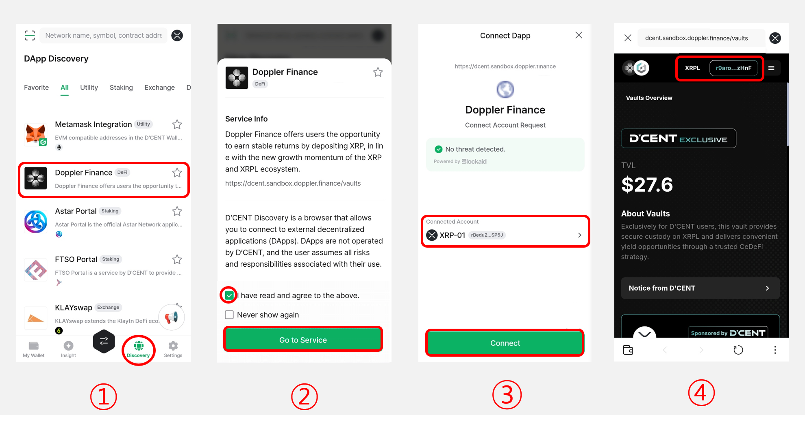
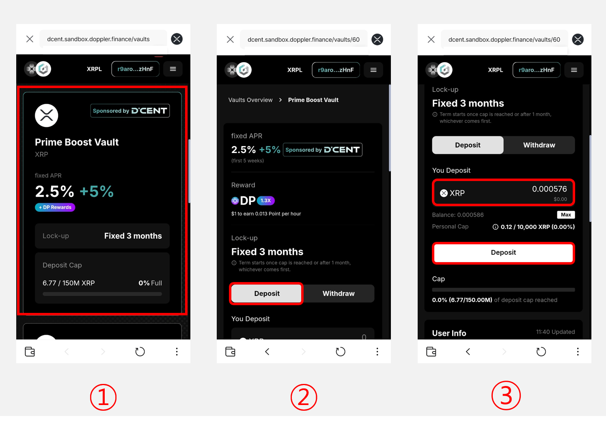
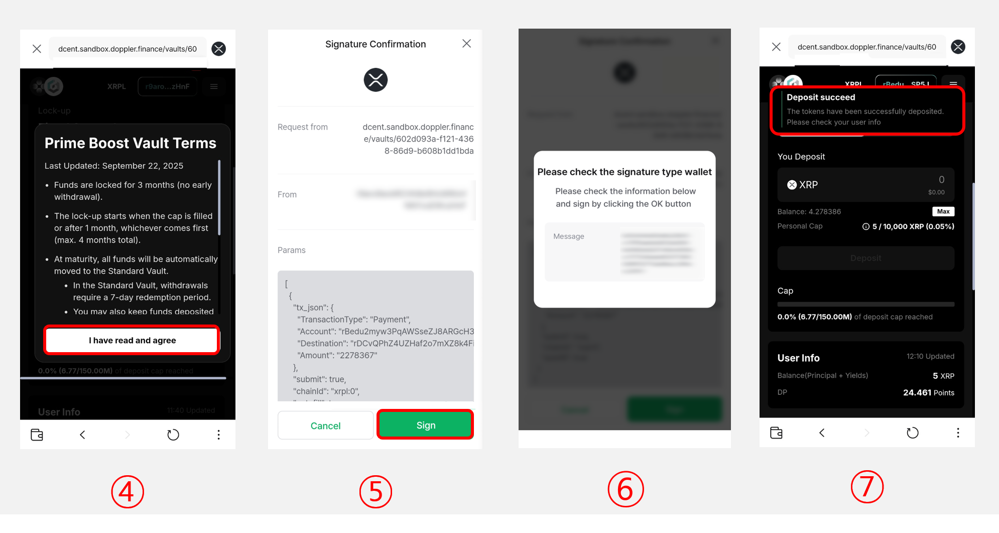
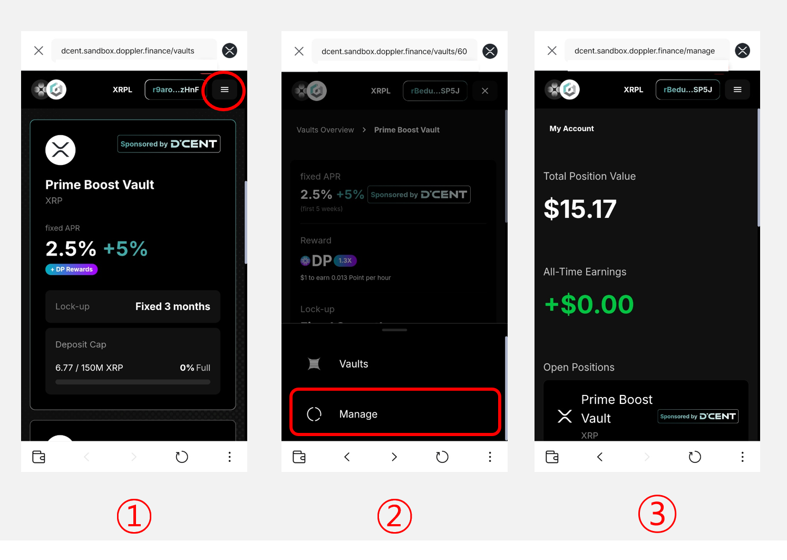
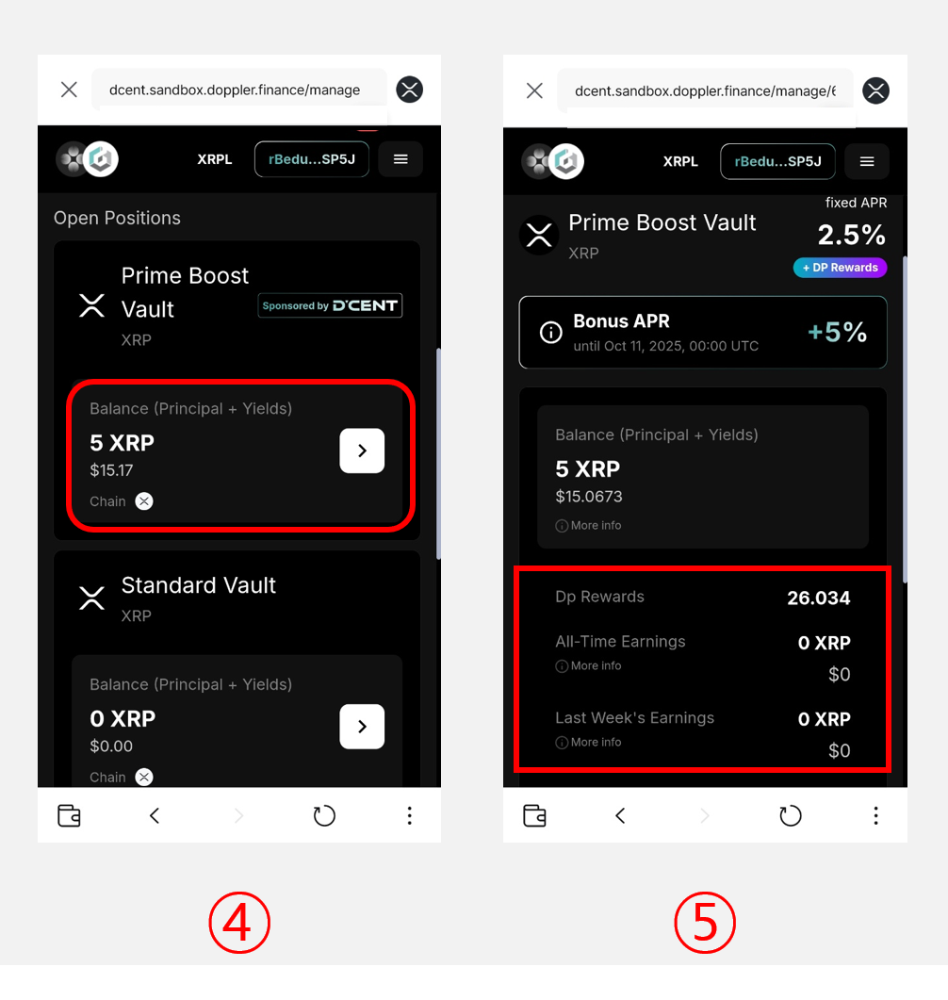
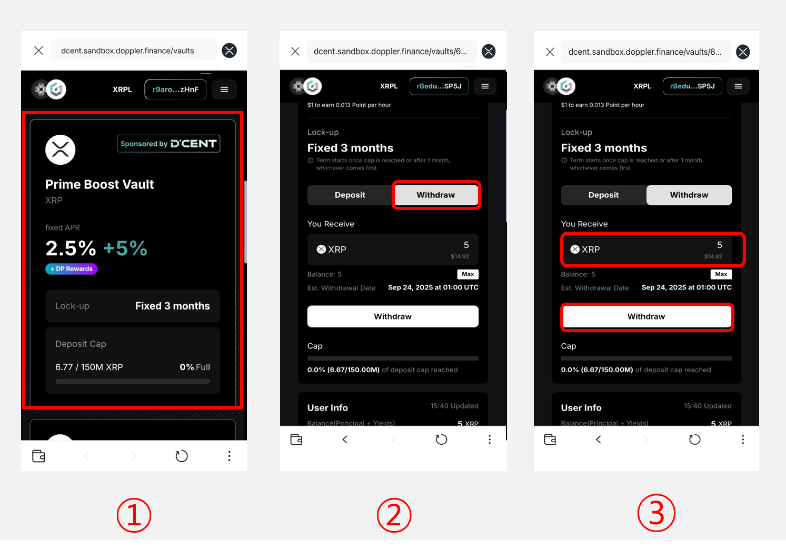
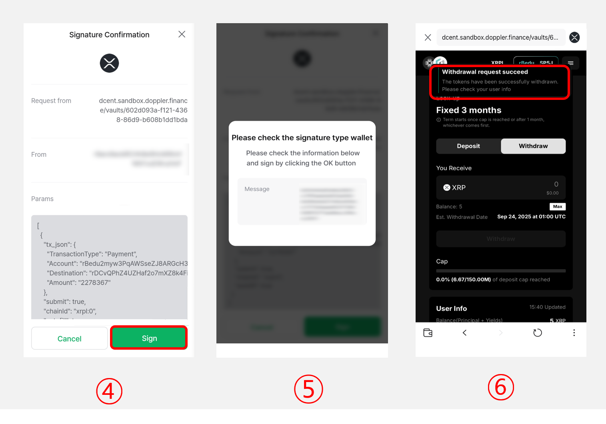

# Doppler Finance - XRP Deposit

## Introduction to the Doppler Finance

Doppler Finance is an **XRPL-based native deposit and yield protocol** built to connect XRP holders with institutional-grade earning infrastructure. By combining **secure asset management, strong risk controls, and transparent operations**, Doppler enables users to generate **sustainable returns** on their XRP.

As a key player in the **XRPfi ecosystem**, Doppler is focused on expanding liquidity, boosting on-chain activity, and delivering a **trusted yield experience** for the global XRP community.

**Now, XRP asset holders can easily make deposits through Doppler Finance.**

## Accessing the Doppler Finance

To access Doppler Finance, you must update both the D'CENT mobile app and the biometric cold wallet to the latest version.


Doppler Finance is supported only in **Biometric Wallet** and **App Wallet(Software)**.&#x20;

**Minimum supported version**

* **Biometric Wallet** firmware version: **v2.35.0 or higher**
* &#x20;**D’CENT mobile** **App** version: **v8.0.4 or higher**


Once updated to the latest version, you can access the Dapp as follows.

<figure><figcaption></figcaption></figure>

**1)** Go to the **"Discovery"** Tab and click **"Doppler Finance"** from the list.

**2)** Check the service information and the notice. Then, tick the checkbox **"I have read and agree to the above,"** and click the **"Go to Service"** button.

**3)** Doppler Finance will request to connect the DApp. Check the XRP account to be connected and click the **"Connect"** button.

**4)** At the top of the Doppler Finance main screen, you can verify that your D'CENT Wallet XRP account is successfully connected.

## **How to deposit XRP via D’CENT Wallet**

<figure><figcaption></figcaption></figure>

**1)** From the Doppler Finance main screen, select the desired **Vault** to deposit into.

**2)** Click on **"Deposit"** button.

**3)** Enter the amount of XRP you want to deposit and click on **"Deposit"**


**You can deposit an amount excluding the lock-up fee required for activating your XRP or XRPL trustline account.** If you click on the **"Max"** button, the amount will be automatically calculated, excluding the lock-up cost.


<figure><figcaption></figcaption></figure>

**4)** Review the detailed terms of the vault and click the **"I have read and agree"** button to proceed.

**5)** A signature request will appear to authorize the deposit. Click **"Sign"** to continue.

**6)** Review the signature details in the wallet and complete the signing process using your fingerprint or PIN.

**7)** Once the signature is complete, the message **"Deposit succeed"** will appear, confirming that your assets have been successfully deposited.

## How to check your deposit details

<figure><figcaption></figcaption></figure>

**1)** Click the **menu icon at the top right corner** of the Doppler Finance main screen.

**2)** From the bottom menu, select **“Manage.”**

**3)** On the **“My Account”** screen, you’ll see the total amount currently deposited.

<figure><figcaption></figcaption></figure>

**4)** Scroll down to view the list of Vaults.

**5)** Tap the desired Vault from the list to check the detailed information, **including deposited amount** and **DP rewards**.

## How to withdraw your deposited funds

The withdrawal process is the same as the deposit process.

<figure><figcaption></figcaption></figure>

**1)** Select the **vault where you’ve deposited funds** from the Doppler Finance main screen.

**2)** Click on **"Withdraw"** button.

**3)** Enter the amount to withdraw, then click on **"Withdraw"** button

<figure><figcaption></figcaption></figure>

**4)** Click on **"Sign"** button to proceed.

**5)** Review the signature details in the wallet and complete the signing process using your fingerprint or PIN.

**6)** Once the signature is completed, a message **"Withdrawal request succeed"** will be displayed, confirming that the withdrawal has been requested. You can check the withdrawn funds in your D’CENT Wallet under the XRP or XRPL trustline account.


D'CENT does not directly operate Doppler Finance. D'CENT helps users easily connect their wallet to Doppler Finance and access the service through the Discovery tab. \
For detailed inquiries regarding the service, **please contact the official Doppler Finance Discord channel** below.&#x20;

* [Go to Doppler Finance Official Discord Channel](https://discord.com/invite/hvDrh3WXhr)

