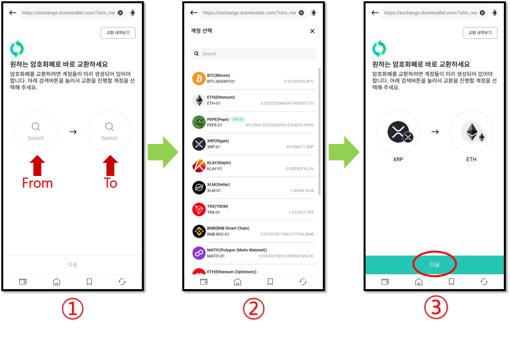
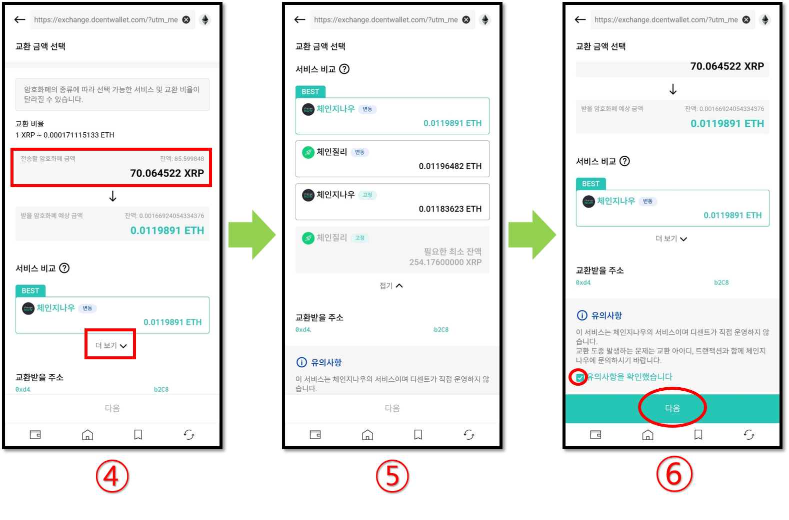
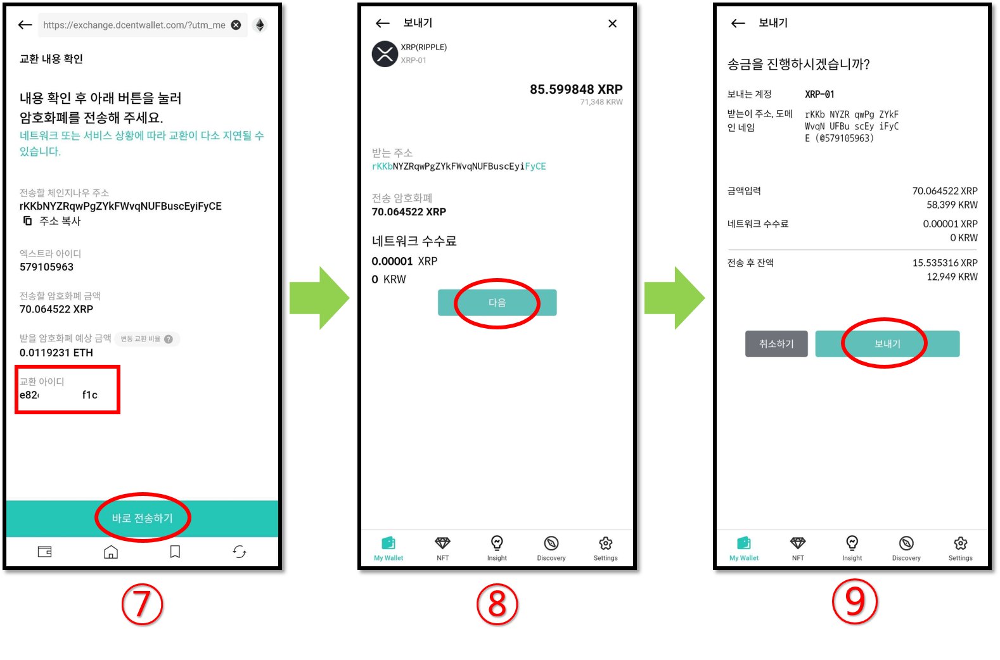
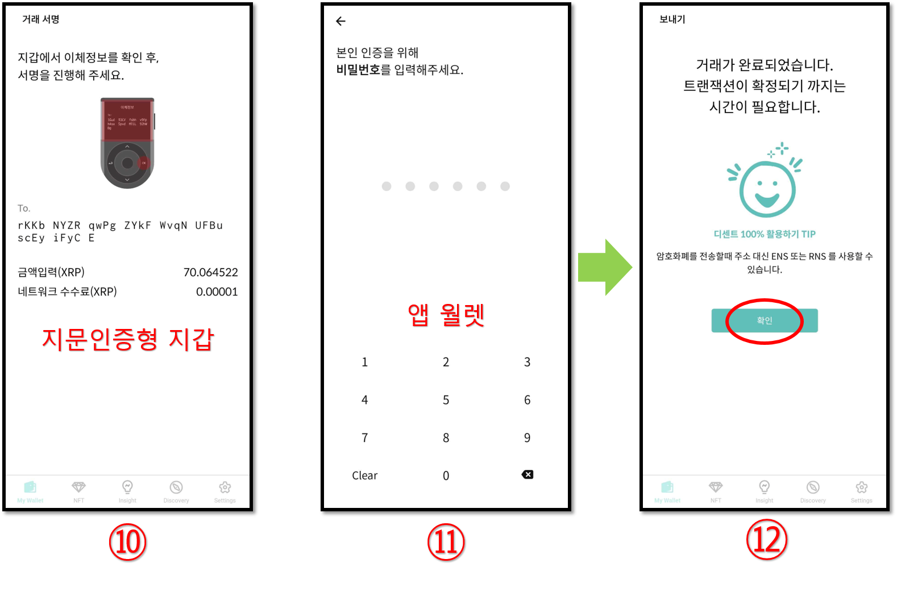
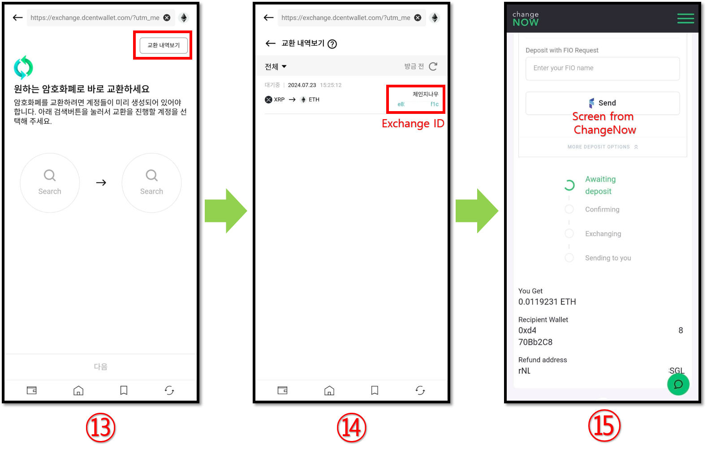

# 교환 (Exchange)

디센트 지갑은 제3자 서비스를 제공하는(Changelly 및 ChangeNOW)와 제휴하여 보유한 자산을 다른 유형의 자산으로 교환할 수 있는 in-app 교환 기능을 제공합니다. 예를 들어 ETH 자산을 지갑에서 직접 BTC 자산으로 교환할 수 있습니다.

**교환(Exchange)** 서비스는 디센트 앱의 "My Wallet" 탭 또는 "Discovery" 탭에서 액세스할 수 있습니다.


**교환(익스체인지)**는 Changelly와 ChangeNOW에서 운영하는 제3자 서비스의 통합입니다. 통합된 익스체인지 서비스를 이용하시기 전에 반드시 해당 서비스 사업자의 이용약관을 숙지하시기 바랍니다.

서비스 이용에 관한 문의사항은 먼저 고객센터에서 답변을 확인해주시기 바랍니다.\
[**Changelly’s help center**](https://support.changelly.com/en/support/home)&#x20;

[**ChangeNOW's help center**](https://support.changenow.io/hc/en-us)&#x20;

도움이 필요한 경우 Exchange(Swap) ID로 사용하신 서비스의 지원팀에 문의하세요.

[**Changelly Support**](https://support.changelly.com/en/support/tickets/new)

[**ChangeNOW Support**](https://support.changenow.io/hc/en-us/requests/new)


## 암호화폐 교환하는 방법

암호화폐를 교환하려면 아래 지침을 따르세요. 이 매뉴얼에서는 XRP를 ETH로 교환하는 예시를 사용합니다.

### 거래 설정

**1.** 교환하려는 자산 유형을 선택하세요.

**2.** 목록에서 교환 가능한 암호화폐를 선택할 수 있습니다.

**3.** 교환할 두 암호화폐를 모두 선택했다면 **"다음"** 버튼을 누릅니다.

### 교환 금액 입력 및 사용할 교환 서비스 선택

원하는 교환 금액을 입력한 뒤 **"더보기"**를 눌러 사용할 교환 서비스를 비교하여 선택할 수 있습니다.

이용 가능한 교환 서비스는 받기로 선택한 암호화폐 유형에 따라 다를 수 있습니다. 또한 각 교환 서비스는 교환을 진행하기 위한 교환 비율과 최소 금액 요구 사항이 다릅니다.

**4.** **ChangeNOW** 교환 서비스입니다. (예상 수취 금액 확인)

**5. Changelly** 교환 서비스입니다. (예상 수취 금액 확인)

**6.** 사용할 교환 서비스를 결정했으면 아래로 스크롤하여 체크박스를 체크한 후 **"다음"** 버튼을 누릅니다.


**변동**은 예상 수취 금액과 실제 수취 금액의 차이가 발생할 수 있습니다. **고정**은 예상 수취 금액 그대로 받을 수 있습니다.


### 거래를 실행하기

**7.** 교환은 귀하가 약정된 자산 금액을 교환 서비스로 이체한 경우에만 이루어집니다. 화면에서 거래내역을 확인하세요. 이 화면에서도 **교환 아이디**를 확인할 수 있습니다.

**8.** 거래 내역을 확인하고 거래 수수료를 설정합니다. 계속하려면 **"다음"** 버튼을 누르십시오.&#x20;

**9.** 송금을 보내기 전에 최종 확인합니다. 계속하려면 **"보내기"** 버튼을 누르십시오.&#x20;

### 거래 승인 하기

**10.** 지갑에서 이제정보를 확인하여 거래를 승인합니다. 지문인증형 지갑의 경우 지문(또는 PIN)으로 거래를 승인해야 합니다.

**11.** 앱 월렛(소프트웨어)을 사용한다면 비밀번호(또는 생체인증)으로 거래를 승인해야 합니다.

**12.** 거래가 완료되었다는 메시지가 표시되면 **"확인"** 버튼을 누릅니다.

### 교환 현황 확인

<figure><figcaption></figcaption></figure>

**13.** **"교환 내역보기"** 버튼을 누르면 교환 내역과 진행 상태를 확인할 수 있습니다.

**14.** 교환 진행 상태에 대한 자세한 내용을 확인하려면 **교환 아이디(Exchange ID)**를 클릭하세요. (체인질리의 경우 교환 아이디를 클릭하여도 자세한 교환 내역을 보여주지 않습니다.)

**15.** 교환 아이디를 클릭하면 교환 서비스 제공업체의 웹사이트에서 자세한 정보를 확인할 수 있습니다.


**교환 내역에 대한 참고 사항**

Exchange ID(교환 아이디) 및 거래내역은 디센트앱에서 최장 15일간 보관 후 삭제됩니다. 교환 아이디의 경우 나중을 위한 참조가 필요한 경우 해당 정보가 삭제되기 전에 미리 기록해 두시기 바랍니다.

