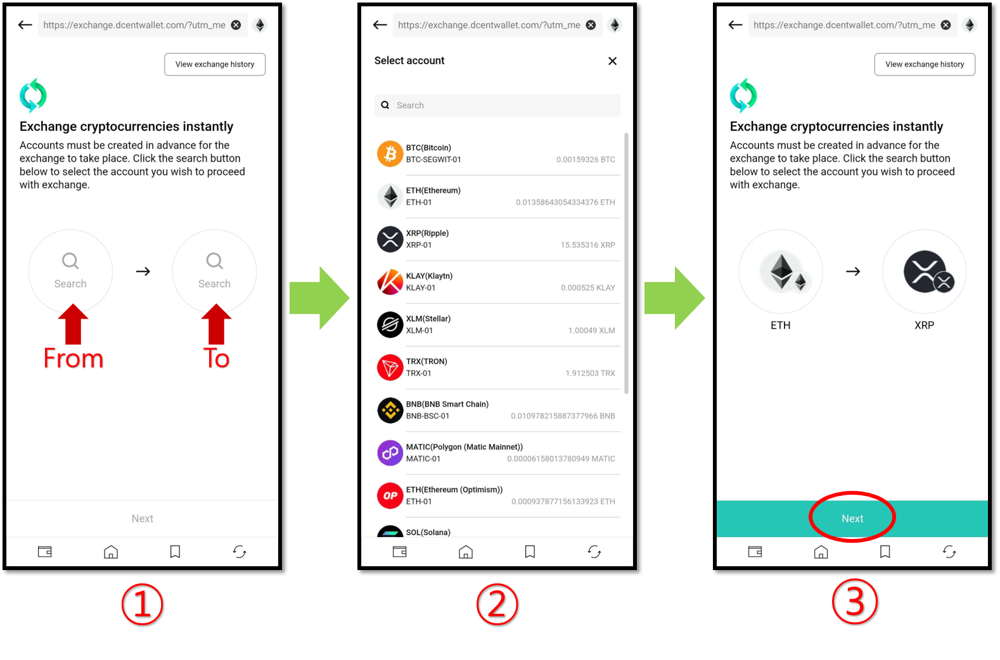
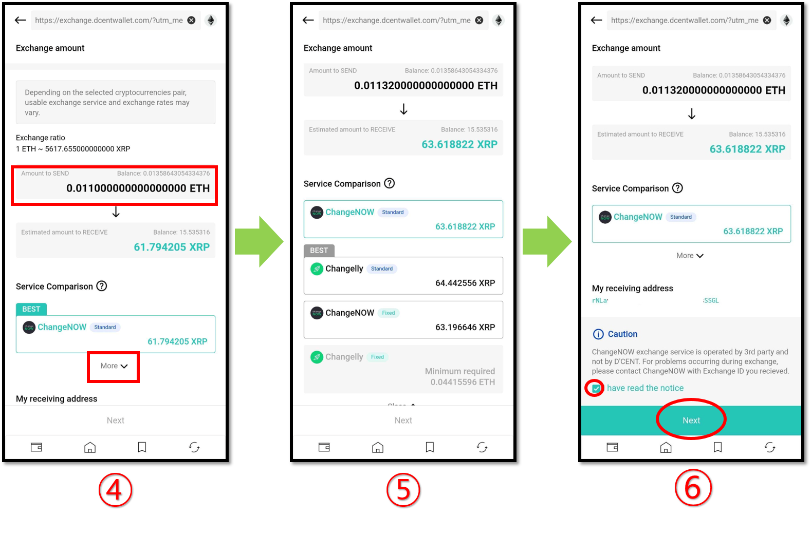
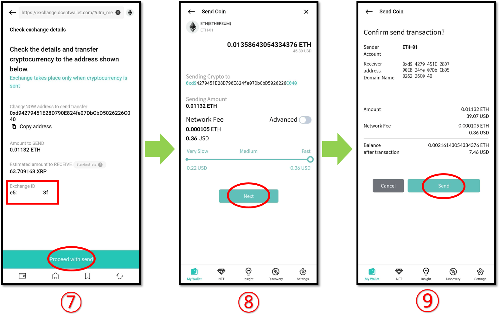
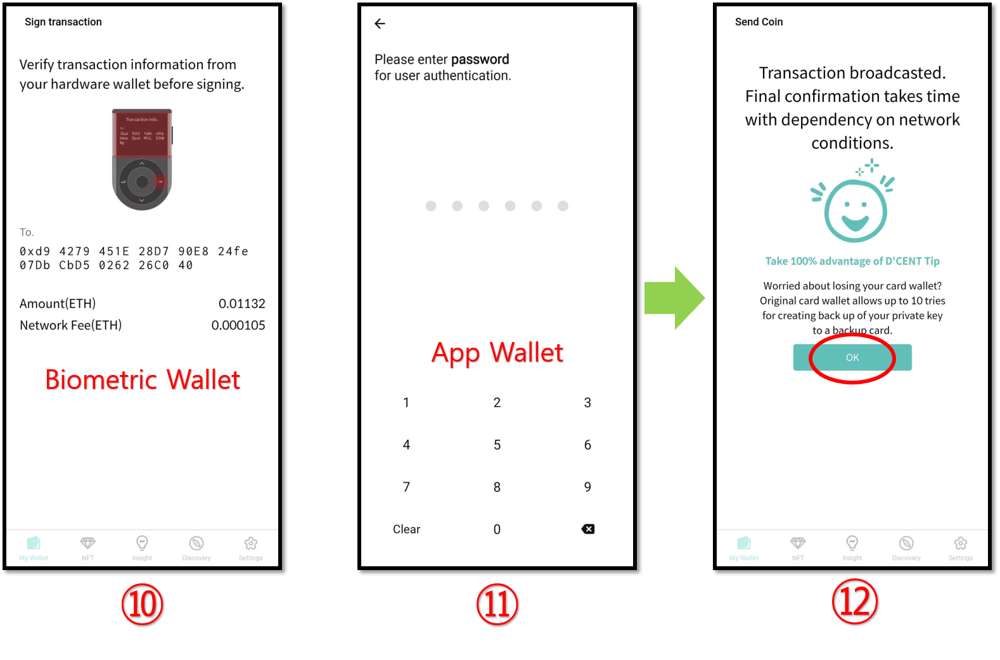
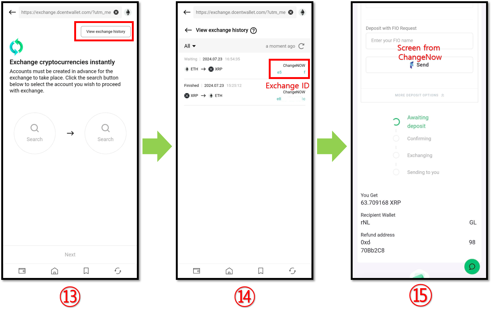

# Exchange

D'CENT Wallet in partnership with 3rd party service providers (Changelly and ChangeNOW), offers the in-app exchange function which enables exchange of an asset type to a second asset type.\
For example, ETH asset can be traded to BTC asset directly from the wallet without the need to visit your external exchanges.

**Exchange** service is accessible from the My Wallet Tab or Discovery Tab of the D'CENT App.


**Exchange** is an integration of 3rd party services operated by Changelly and ChangeNOW.&#x20;

Before using the services of the integrated exchanges, make sure to know their terms and conditions.&#x20;

For any inquiries about use of the service, please make sure to first check out the help center for answers.\
[**Changelly’s help center**](https://support.changelly.com/en/support/home)&#x20;

[**ChangeNOW's help center**](https://support.changenow.io/hc/en-us)&#x20;

If assistance is required, please reach out to the service's support with your Exchange (Swap) ID.

[**Changelly Support**](https://support.changelly.com/en/support/tickets/new)

[**ChangeNOW Support**](https://support.changenow.io/hc/en-us/requests/new)


## How to exchange your cryptocurrency

To exchange your cryptocurrency, please follow the instructions below. In this manual, we will exchange ETH for XRP.

### Set up your trade

**1.** Choose the asset types that you would like to exchange.

**2.** You can select the exchangeable currency from the list.

**3.** Once you've both cryptocurrencies for exchange, press the **"Next"** button.

### Enter exchange amount and choose an exchange service to use

You can enter the amount you wish to exchange and click **"More"** to compare and select the exchange service you want to use.

Depending on the type of cryptocurrency you've chosen to receive, there may be different exchange services that can be used. Each exchange service provides different exchange ratio and minimum amount requirement for the exchange to proceed.

**4.** This is the **ChangeNOW** exchange service (check the estimated receivable amount).

**5.** This is the **Changelly** exchange service (check the estimated receivable amount).

**6.** Once you've decided on an exchange to use, scroll down to bottom and tick on the box. Press the **"Next"** button to continue.


**Standard exchange rate** : There may be discrepancies between the receiving amount displayed and the actual amount that will be received.\
**Fixed exchange rate** : You can receive the cryptocurrency in the amount shown.


### Execute the trade

**7.** Exchange will take place only when you've transferred the agreed amount of asset to the exchange service. Check the details of the transaction on the screen. You can also check the **Exchange ID** on this screen.

**8.** Check the transaction details and set the transaction fee. Press the **"Next"** button to continue.&#x20;

**9.** Final check before you send the transfer. Press the **"Send"** button to continue.&#x20;

### Authorize the trade&#x20;

**10.** Check the details in your wallet and approve the transaction. For biometric wallet, you will need to authorize the trade with your fingerprint(or PIN).

**11.** For app wallet(software), you will need to authorize the trade with password(or biometrics).

**12.** When the message displaying that the transaction is complete, click the **"OK"** button.

### Check the exchange status

<figure><figcaption></figcaption></figure>

**13.** Please click the **"View exchange history"** button to check the exchange history and progress status.

**14.** You can check the status of your exchange request from the Exchange History tab.&#x20;

**15.** For detailed information, click on the Exchange ID, you can view detailed information on the exchange service provider's website. (In the case of Changelly, the detailed exchange history is not displayed even if you click the Exchange ID).


**NOTE on Exchange History**&#x20;

Exchange ID and its transaction record will be maintained by the D'CENT App for 15 days and will be deleted thereafter. Please back up this information for referencing in the future before it gets deleted.

