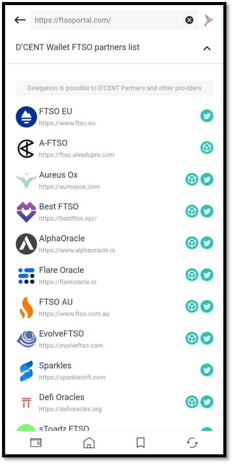

# FTSO Portal - vote delegation

## Introduction to the D'CENT FTSO Portal

FTSO Portal is a feature that allows users to interact with FTSO features on the Songbird and Flare Networks. SGB and FLR ​​holders can delegate Vote Power to their favorite FTSO providers on the Songbird and Flare Network.

### Accessing the FTSO portal 

FTSO portal can be found from the Discovery Tab(DApp browser) of the D’CENT Mobile App.

1. Go to the Discovery Tab and click **"FTSO Portal"** from the list.
2. Connect to the FTSO Portal site with your wallet (Songbird or Flare) address to continue.

### Swapping SGB or FLR tokens to wrapped tokens

To delegate your vote power to an FTSO provider, you must first to **swap SGB or FLR tokens to a wrapped token such as WSGB or WFLR.**

For example, we will connect to the FTSO portal using the Songbird Network and swap SGB to WSGB.

1. Click on the Swap button.
2. Set the amount to swap and click the button below.
3. Press **"Confirm"** to continue.

4. Press **"OK"** and authenticate to sign this transaction.
5. Press **"Confirm"** to continue.
6. You can see the swapped WSGB balance in the portfolio section.

### Vote Power delegation with WSGB 

1. Scroll down to "**My Delegation**' and click on **+ Add delegation**. Note that you can currently add up to 2 delegations.
2. List of FTSO providers with voting power rates is shown in random order. To delegate Vote Power to an FTSO provider, click on the drop-down button next to the provider’s name.
3. Enter the amount(**% rate**) you want to delegate. For example, we have 100 WSGB in the balance. Setting the delegation rate to 50% will delegate **100 WSGB \* 0.50% =** **50 WSGB**. Note that you can also check when the reward period will be for each delegation.

4. To finalize the delegation, you will need to sign a transaction. Press **"Confirm"** to continue.
5. Press **"OK"** and authenticate, which will sign this transaction.
6. Press **"Confirm"** to continue.

### Checking my delegation status 

1. Note that delegating Vote Power to an FTSO provider does not transfer your WSGB and all of your WSGB stays in your wallet.
2. From **"My Delegation",** you can see the delegation status of 50 WSGB(Vote Power) delegated to an FTSO provider.
3. If there is any reward that can be claimed, it will show up on the **"My claimable reward"** section.

🚨 **Rewards are paid out every Saturday and will disappear if you don’t collect them for 90 days. Be sure to claim your rewards periodically every week. 🚨**

### Undelegating Vote Power 

1. To un-delegate your Vote Power from an FTSO, from **"My Delegation"** Click the **"Undelegate"** button.
2. Select the FTSO provider you want to undelegate and click the **“Undelegate”** button.
3. Press **"Confirm"** to continue.
4. To finalize the undelegation order, you must sign a transaction. Press **"OK"** and authenticate to sign.

### D’CENT FTSO Partners List 

[FTSO AU](https://www.ftso.com.au/) | [AlphaOracle](https://www.alphaoracle.io/) | [ScandiNodes FTSO](https://ftso.scandinodes.com/) | [Aureus Ox](https://aureusox.com/) | [FTSO UK](https://www.ftso.uk/)\
[Use Your Spark](https://www.useyourspark.com/) | [Defi Oracles](https://defioracles.org/) | [FTSO EU](https://www.ftso.eu/) | [Best FTSO](https://bestftso.xyz/) | [Bifrost Oracle](https://towolabs.com/) | [FlareFi](https://flarefi.tech)\
[Sparkles](https://sparklesnft.com/) | [A-FTSO](https://ftso.alexdupre.com/) | [EvolveFTSO](https://evolveftso.com/) | [sToadz FTSO](https://xtoadz.xyz/signal-provider) | [Flare Oracle](https://flareoracle.io/) \
And more to join!

FTSO partners listed are the FTSO providers that have integrated with D’CENT Wallet for the seamless experience in using the FTSO functions while protected by an additional layer of security when users interact with the FTSO provider services. All FTSO partners have put great effort and are dedicated to bringing the best possible FTSO delegation experience to our motivated users in the ecosystem.

