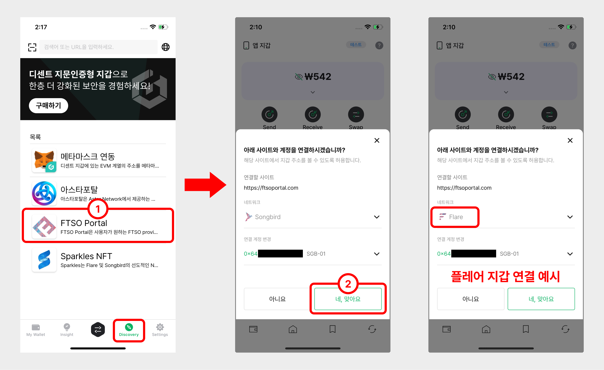
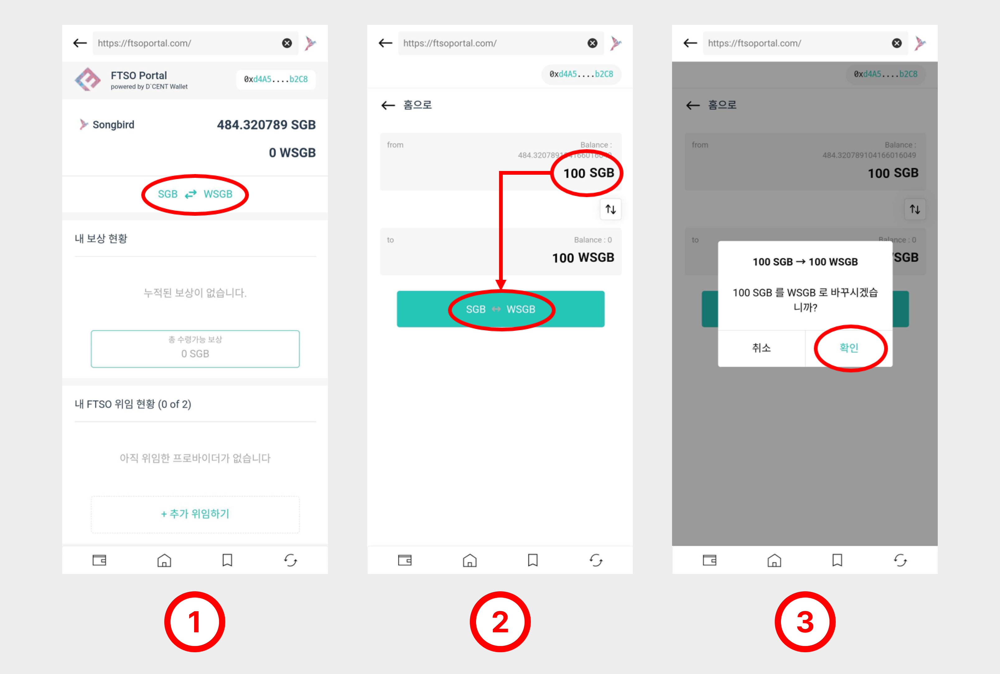
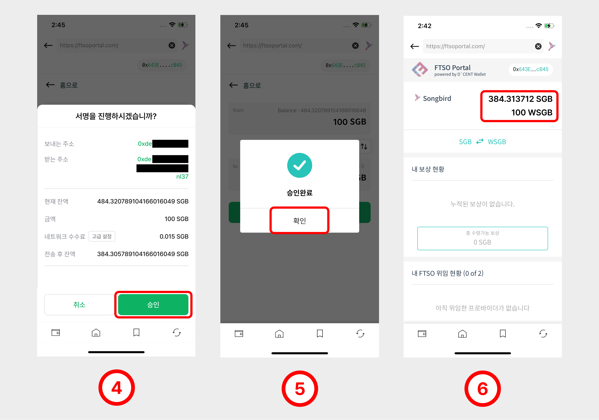
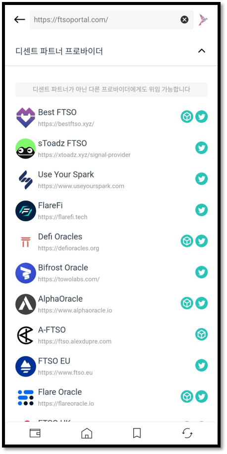

# FTSO 포털 - 투표권 위임

## FTSO 포털 소개

FTSO 포털 (FTSO Portal) 은 사용자가 송버드(Songbird) 와 플레어(Flare) 네트워크에서 FTSO 기능과 상호 작용할 수 있는 기능입니다. SGB와 FLR 보유자는 송버드/플레어 네트워크에서 선호하는 FTSO 제공자에게 투표권을 위임할 수 있습니다.

### FTSO 포털 액세스 

FTSO 포털은 디센트 모바일 앱의 Discovery 탭(DApp 브라우저)에서 찾을 수 있습니다.

<figure><figcaption></figcaption></figure>

1. 댑 브라우저(Discovery)의 목록에서 **FTSO Portal** 을 클릭합니다.
2. 이동된 FTSO 포털 사이트에서 송버드 혹은 플레어 지갑 주소로 접속(연결)합니다 .

### SGB 또는 FLR 토큰을 래핑된 토큰으로 교환

FTSO 제공자에게 투표권을 위임하려면 먼저 **SGB 또는 FLR 토큰을 WSGB나 WFLR와 같은 래핑된 토큰으로 교환**해야 합니다.

여기서는 송버드 네트워크로 FTSO 포털에 접속하여 SGB를 WSGB로 교환해보겠습니다.

1. 교환 버튼을 클릭합니다.
2. 교환할 토큰의 수량을 설정하고 아래 버튼을 클릭하세요.
3. 계속하려면 **"확인"**&#xC744; 누르십시오.

4. **"승인"**&#xC744; 누르고 인증하여 이 거래에 서명합니다.
5. 계속하려면 **"확인"**&#xC744; 누르십시오.
6. 스왑된 WSGB 잔액은 포트폴리오 섹션에서 확인할 수 있습니다.

### WSGB를 통한 투표권 위임 

1. "**내 FTSO 위임 현황"**&#xAE4C;지 아래로 스크롤하고 **"+ 추가 위임하기"**&#xB97C; 클릭합니다. 현재 최대 2개까지 위임을 추가할 수 있습니다.
2. 투표율이 보이는 FTSO 제공자 목록은 임의의 순서로 표시됩니다. FTSO 제공자에게 투표권을 위임하려면 제공자 이름 옆에 있는 드롭다운 버튼을 클릭하십시오.
3. 위임할 비율(% rate)을 입력합니다. 예를 들어, 잔액에 100 WSGB가 있습니다. 위임 비율을 50%로 설정하면 **100 WSGB x 0.50% = 50 WSGB**를 위임합니다. 각 위임에 대한 보상 기간도 확인할 수 있습니다.

4. 위임을 완료하려면 거래에 서명해야 합니다. 계속하려면 **"확인"**&#xC744; 누르세요.
5. **"승인"**&#xC744; 누르고 인증하면 해당 거래에 서명됩니다.
6. 계속하려면 **"확인"**&#xC744; 누르세요.

### 나의 위임 상태 확인하기 

1. FTSO 제공자에게 투표권을 위임한다고 해서 WSGB가 전송되는 것은 아니며 모든 WSGB가 지갑에 남습니다.
2. "**내 FTSO 위임 현황**" 에서 FTSO 제공자에게 위임된 **50 WSGB(Vote Power)**&#xC758; 위임 현황을 확인할 수 있습니다.
3. 받을 수 있는 보상이 있으면 **"내 보상 현황"** 항목에 표시됩니다.

🚨 **보상은 매주 토요일 지급되며 90일동안 보상을 수령하지 않으면 사라지게됩니다. 매주 보상을 주기적으로 수령(Claim)하시기 바랍니다**. 🚨

### 투표권 위임 해제 

1. FTSO에서 귀하의 투표권 위임을 해지하려면 "**내 FTSO 위임 현황**" 에서 **"위임 해제"** 버튼을 클릭합니다.
2. 해제할 FTSO 제공자를 선택하여 **"위임 해제"** 버튼을 클릭합니다.
3. 계속하려면 **"확인"**&#xC744; 누르세요.
4. 위임 해지 명령을 완료하려면 거래에 서명해야 합니다. **"승인"**&#xC744; 누르고 인증하면 해당 거래에 서명됩니다.

### 디센트 FTSO 파트너 목록 

[FTSO AU](https://www.ftso.com.au/) | [AlphaOracle](https://www.alphaoracle.io/) | [ScandiNodes FTSO](https://ftso.scandinodes.com/) | [Aureus Ox](https://aureusox.com/) | [FTSO UK](https://www.ftso.uk/)\
[Use Your Spark](https://www.useyourspark.com/) | [Defi Oracles](https://defioracles.org/) | [FTSO EU](https://www.ftso.eu/) | [Best FTSO](https://bestftso.xyz/) | [Bifrost Oracle](https://towolabs.com/) | [FlareFi](https://flarefi.tech)\
[Sparkles](https://sparklesnft.com/) | [A-FTSO](https://ftso.alexdupre.com/) | [EvolveFTSO](https://evolveftso.com/) | [sToadz FTSO](https://xtoadz.xyz/signal-provider) | [Flare Oracle](https://flareoracle.io/) \
새로운 파트너는 계속하여 추가됩니다!

나열된 FTSO 파트너는 사용자가 FTSO 제공자 서비스와 상호 작용할 때 디센트 지갑을 통해 한층 업그레이드된 보안으로 보호되는 동시에 FTSO 기능을 사용할때 원활한 경험을 위해 디센트 지갑과 통합된 FTSO 제공자입니다. 모든 FTSO 파트너는 생태계의 사용자에게 최상의 FTSO 위임 경험을 제공하기 위해 많은 노력을 기울였습니다.
