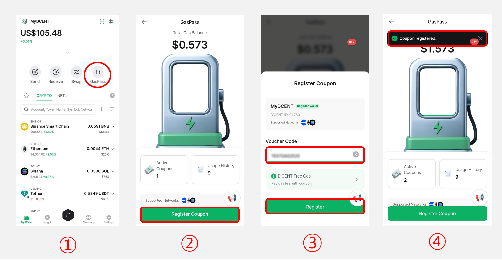
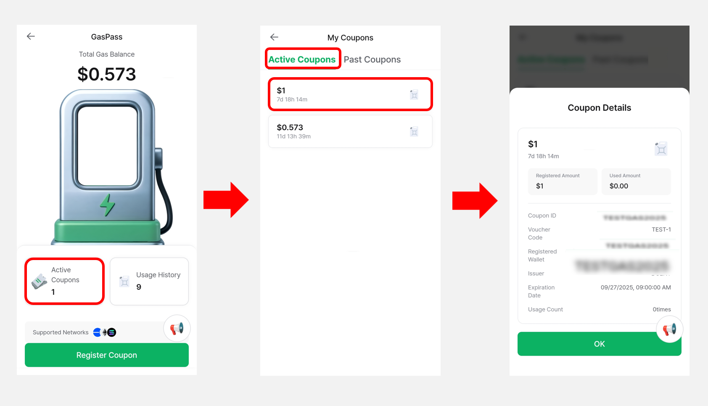
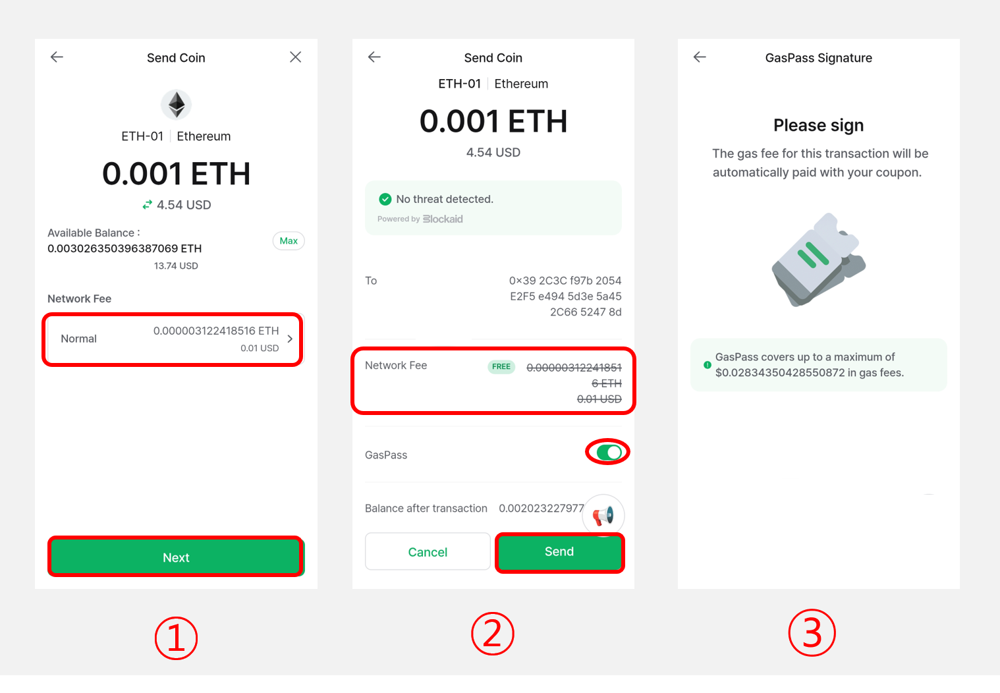
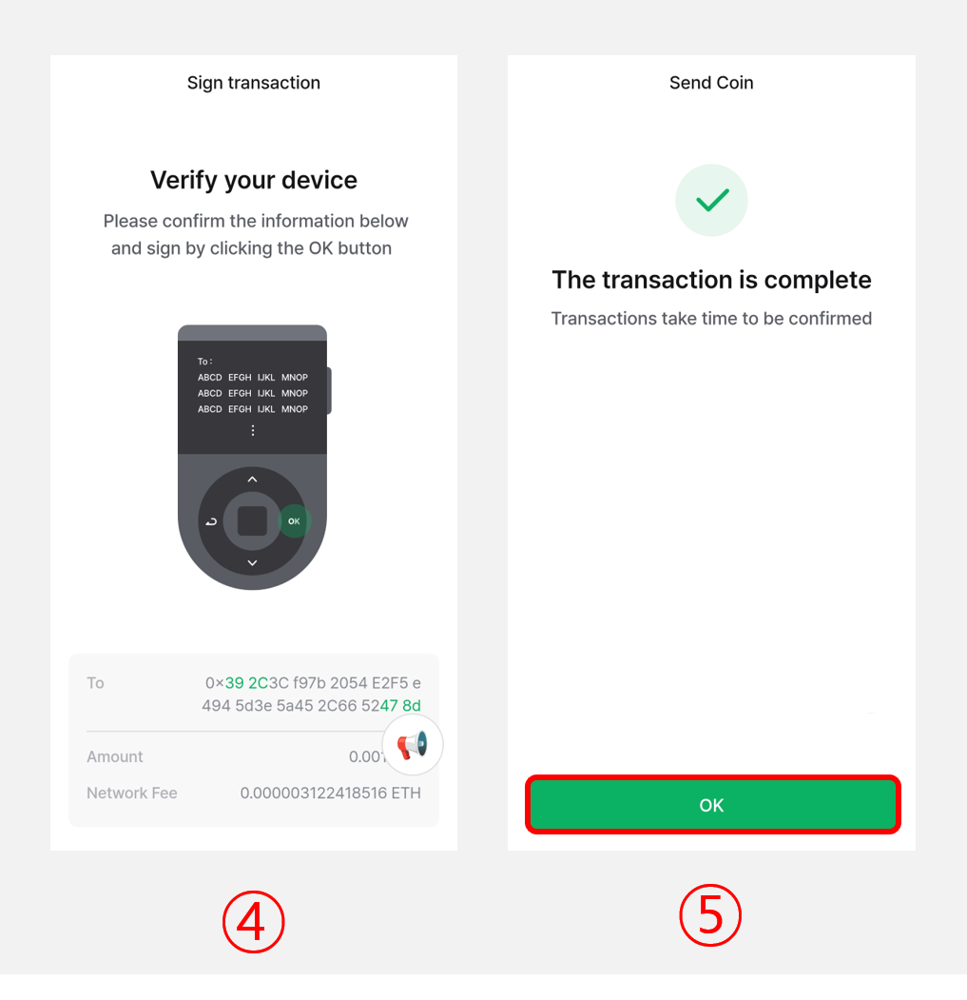
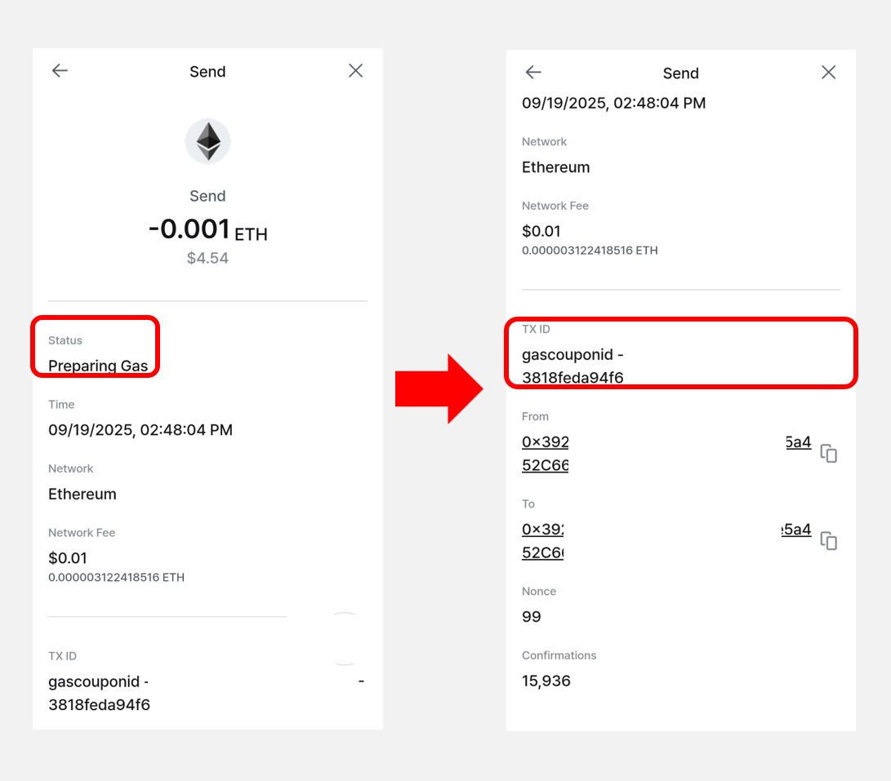
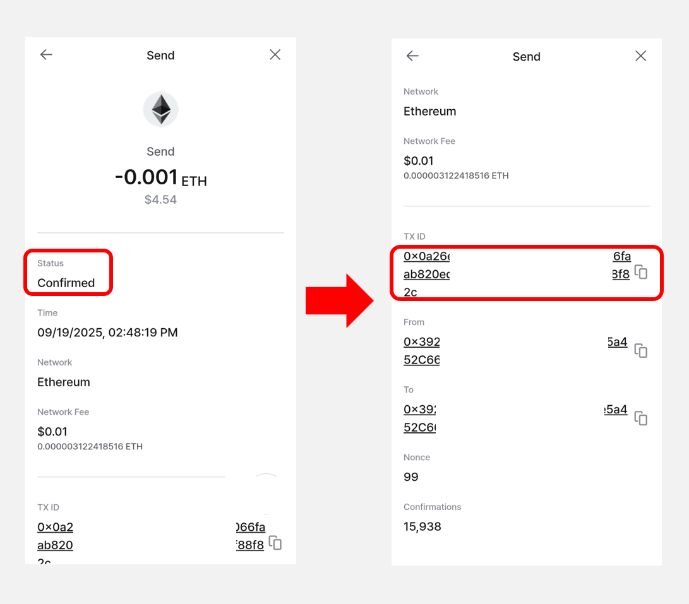
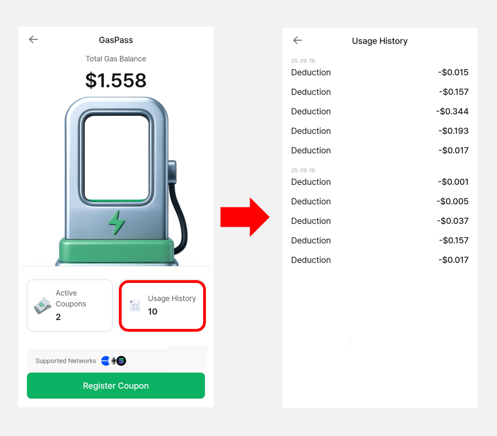

# GasPass

GasPass is a feature that allows you to make transactions without worrying about gas fees by using coupons. By registering various coupons (vouchers) in the **“GasPass”** menu, the gas fees for transfers or swaps are automatically paid to the blockchain using your available coupons.


**GasPass currently supports the following networks:**

* Ethereum (ERC20)
* Base (BASE-ERC20)


## How to Register GasPass

Follow the steps below to register your GasPass:

<figure><figcaption></figcaption></figure>

**1)** In the **My Wallet** tab, tap the **“GasPass”** button.

**2)** Click on **“Register Coupon.”**

**3)** Enter the **voucher code of the coupon you own**, and **click** **“Register.”**

**4)** A confirmation message will appear indicating that the coupon has been successfully registered.

<figure><figcaption></figcaption></figure>

Once a coupon has been successfully registered, you will see your **Total Gas Balance** displayed in the **GasPass** menu.

To view the details of a registered coupon, **click** the **“Active Coupons”** button.\
The **Coupon Details** screen will show the coupon’s **Registered amount**, **Used amount**, **Expiration date**, **Usage count**, and other relevant information.

## How to Send Coins Using GasPass

Sending coins with GasPass is no different from the usual method.

### Sending Coin

Please refer to [**this guide**](https://userguide.dcentwallet.com/coin-send-receive/send) to learn how to send coin.

<figure><figcaption></figcaption></figure>

**1)** After entering the amount you want to send and setting the network fee, click the **"Next"** button.

**2) On the transaction review screen, GasPass is automatically applied, and the network fee will be deducted using the available coupon balance.** You can also manually disable GasPass if needed.&#x20;

Click the **"Send"** button to proceed.

**3)** If GasPass is applied, **you will first need to sign the transaction to automatically pay the network fee with the coupon.** Check the transaction details on your wallet and authenticate with your fingerprint or PIN.

<figure><figcaption></figcaption></figure>

**4)** You will then need to sign the transaction to send the coin. Please check the transaction details on your wallet and authenticate with your fingerprint or PIN.

**5)** Once the transaction has been sent to the blockchain, a confirmation message will appear in the mobile app. Tap the **“OK”** button to return to the main screen.

### Swap

Please refer to [**this guide**](https://userguide.dcentwallet.com/native-service/swap) to learn how to use Swap service.

<figure><figcaption></figcaption></figure>

**1)** When using the swap service, **if you have a registered GasPass, it will be automatically applied on the estimate screen** after you enter the swap amount.

**2)** You can also confirm that GasPass is applied on the swap transaction review screen. If needed, you can manually disable GasPass. Click the **“Confirm”** button to proceed.

**3)** If GasPass is applied, **you will first need to sign the transaction to automatically pay the network fee with the coupon.** Check the transaction details on your wallet and authenticate with your fingerprint or PIN.

<figure><figcaption></figcaption></figure>

**4)** You will then need to sign the transaction to send the coin. Please check the transaction details on your wallet and authenticate with your fingerprint or PIN.

**5)** Once the transaction data is sent to the blockchain, the mobile app will display the expected amount of tokens you will receive. Click the **“Complete”** button to return to the main screen.

## How to Check Transaction History with GasPass Applied

Please refer to [**this guide**](https://userguide.dcentwallet.com/coin-send-receive/checking-transaction-status-and-history) to learn how to check transaction history.

<figure><figcaption></figcaption></figure>

When a transaction is created with GasPass applied, the gas fee (network fee) is paid in advance to the blockchain using a coupon. Therefore, the transaction status will display **“Preparing Gas.”**\
In addition, the **TXID** will show the **issued coupon ID (gascouponid)**.

<figure><figcaption></figcaption></figure>

Once the gas fee has been successfully paid with GasPass and the transaction is confirmed, the transaction status will update to **“Confirmed.”** The **TXID** will then be updated to the actual **transaction ID**.

## How to Check GasPass Usage History

<figure><figcaption></figcaption></figure>

By clicking the **“Usage History”** button in the GasPass menu, you can view a detailed breakdown of gas fees deducted for each transaction.


**If multiple gas coupons are registered, they will be applied automatically starting with the one closest to expiration.**

