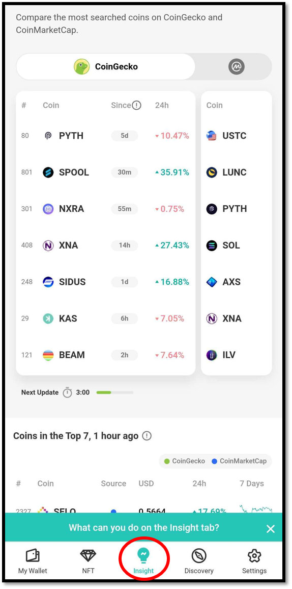
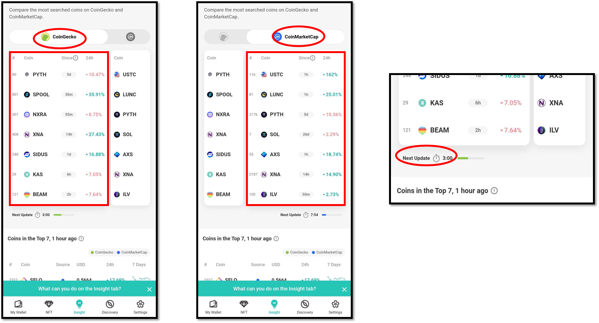
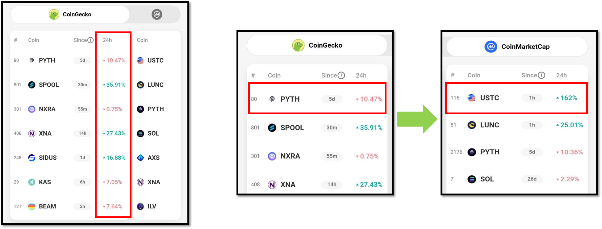
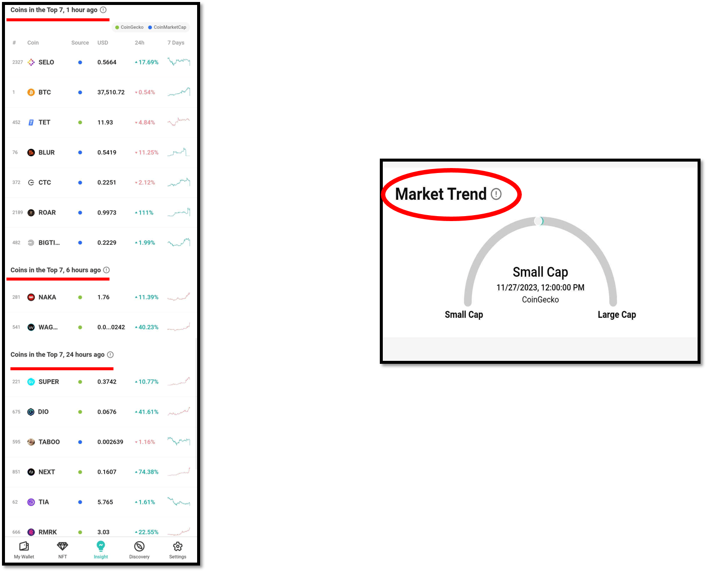
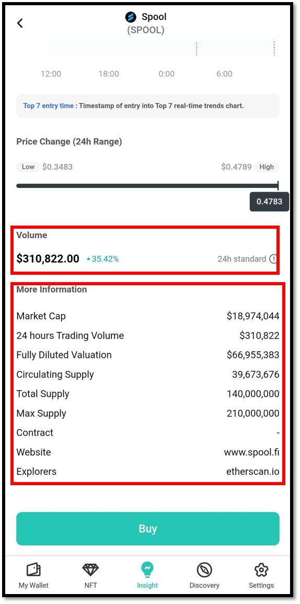
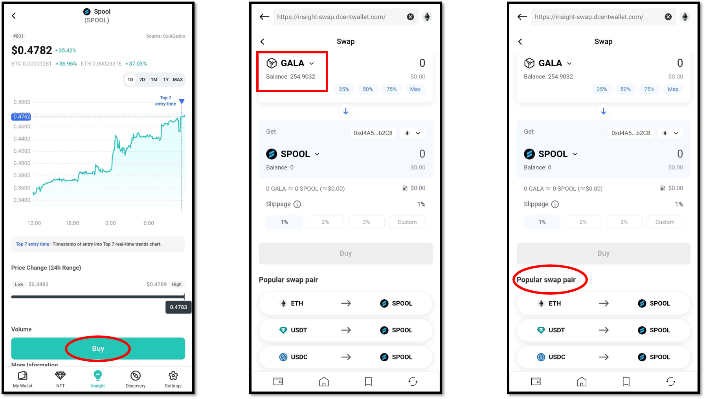

# Insight

Insight is a new service that **provides accurate information for asset management by intuitively checking the market trend of various cryptocurrency coins.**

Insight service provides a real-time updated **top 7 list of the most searched cryptocurrency coins on CoinGecko and CoinMarketCap.** You can also see real-time market trends, price changes, and detailed information for each coin, and make purchases easily and conveniently.


Insight service is supported from D'CENT mobile app **version 6.0.0** **or higher.**


## How to use Insight

**1)** You can access the Insight service by touching the **"Insight"** tab on the bottom of the D'CENT app.\
If you cannot see the Insight tab, please update D'CENT mobile app to the latest version.

<figure><figcaption></figcaption></figure>

**2)** When you access the Insight tab, you can see the **Top7 list of the currently most popular cryptocurrencies** on **CoinGecko and CoinMarketCap.**\
You can **easily switch between services by swiping left and right on the Top7 list screen** and compare the ranking of popular coins on each service.

The Top7 list is updated every **5 minutes on CoinGecko** and **every 10 minutes on CoinMarketCap**.

<figure><figcaption></figcaption></figure>

**3)** Numbers (%) next to the Top7 list display the **percentage change in price range the latest 24 hours.**\
If the same coin is in the Top7 list on both CoinGecko and CoinMarketCap, you can compare the percentage change in price on each service.

<figure><figcaption></figcaption></figure>

**4)** In the bottom of the Top7 list, displayed are lists of coins that ranked in the Top7 by time: **1 hour ago, 6 hours ago, 24 hours ago.**

**"Market trend"** indicates whether the coins that have entered the trending list in the last 6 hours are mostly **Large or Small Cap** .

<figure><figcaption></figcaption></figure>

## How to check coin information in Insight

You can select desired coins in the Top7 list to view coin information.

Coin information is displayed with the **current market price** **(Ⓐ)** and **Top7 entry time (Ⓑ)**, and **the price change range in the last 24 hours** **(Ⓒ)** can be viewed at a glance.\
And you can touch the price change flow graph to see the status of price at that point in time.

If you wanted to purchase the coin, you can purchase it through the Swap service by touching the **"Buy" button (Ⓓ )**.

<figure><figcaption></figcaption></figure>

When you scroll down the screen, you can see the trading volume for the last 24 hours, and **"Details"** will display the coin's maket cap, circulating supply, total supply, explorers (supported blockchain), and more information.

<figure><figcaption></figcaption></figure>

## Buy coin in Insight

Check the details of a coin in the Top7 list in the Insight tab. You can touch the **"Buy"** button to purchase the coin easily and conveniently.


Currently the Insight **only offers purchasing an asset via Swap service**. If the coin network is a one that is not supported by the Swap Service, the "Buy" button will be inactive (stays in shaded grey).


Purchases can be made through the '**Swap**' service using the coins held in the D'CENT wallet. You can select the desired coin from the ones you have, or confirm the transaction pair by swapping the coin through the '**Popular Swap Pairs**'.

<figure><figcaption></figcaption></figure>

For more information on how to use the Swap service, please check the link below.


[swap.md](swap.md)

