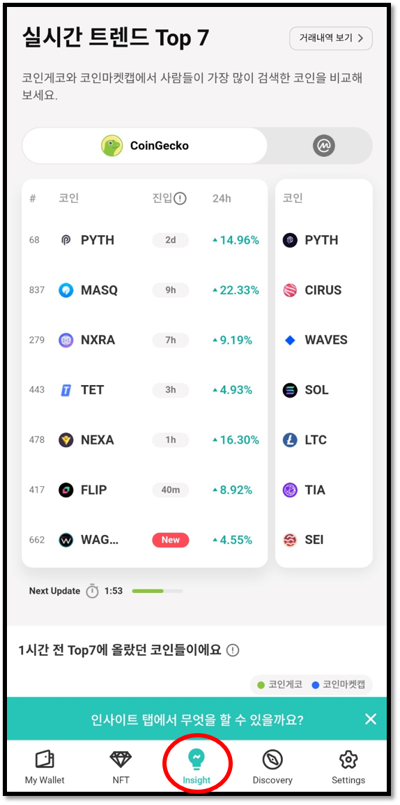
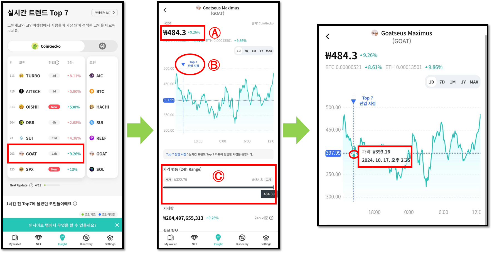

# 인사이트 (Insight)

인사이트 (Insight)는 **다양한 암호화폐 코인의 시장추이를 직관적으로 확인하여 자산 관리를 위한 정확한 정보를 제공하는 새로운 서비스**입니다.

인사이트 서비스는 **코인게코와 코인마켓캡에서 사용자들이 가장 많이 검색한 암호화폐 코인 중 상위 검색 Top7 리스트**를 실시간으로 순위별로 확인할 수 있으며, 각 코인의 실시간 시장 추이와 가격 변동 및 상세 정보를 직접 확인하고 구매까지 쉽고 간편하게 진행할 수 있습니다.


인사이트 서비스는 디센트 모바일 앱 버전 **6.0.0 이상**부터 지원합니다.


## 인사이트 이용 방법

**1)** 디센트 앱 하단 **"Insight"** 탭을 눌러 서비스를 이용할 수 있습니다.\
Insight 탭이 보이지 않다면 디센트 모바일 앱을 최신 버전으로 업데이트 하시기 바랍니다.

<figure><figcaption></figcaption></figure>

**2)** 인사이트 탭에 접속하면 **코인게코와 코인마켓캡**에서 **현재 가장 인기있는 암호화폐 Top7 리스트**를 확인할 수 있습니다.\
Top7 리스트 **화면을 좌우로 스와이프하여** 간편하게 서비스별 리스트를 전환할 수 있고 서비스마다 인기있는 코인의 순위를 비교해볼 수 있습니다.

Top7 리스트는 **코인게코 5분마다 그리고 코인마켓캡은 10분마다** 업데이트 됩니다.

<figure><figcaption></figcaption></figure>

**3)** Top7 리스트 옆의 숫자는 최근 24시간 동안 가격 변동율을 보여줍니다.\
만약 코인게코와 코인마켓캡에서 동일한 코인이 Top7 에 있다면 각 서비스마다 가격 변동율을 비교해 볼 수 있습니다.

<figure><figcaption></figcaption></figure>

4\) Top7 리스트 하단에는 **1시간 전, 6시간 전, 24시간 전** 등 시간대별로 Top7에 올랐던 코인들의 목록을 확인할 수 있습니다.

**"시장 추이"** 는 코인게코 및 코인마켓캡에서 지난 6시간 동안 트렌딩 리스트에 진입한 코인들의 시가 총액이 크기를 **"Small Cap"** 혹은 **"Large Cap"** 으로 측정하여 그래프로보여줍니다.

<figure><figcaption></figcaption></figure>

## 인사이트에서 코인 정보 확인하기

Top7 리스트에서 원하는 코인을 선택하면 상세 정보를 볼 수 있습니다.

코인의 상세 정보를 확인하면 현재 **Ⓐ시가 정보**와 **ⒷTop7 진입 시점**이 표시되며, **Ⓒ최근 24시간 동안 가격 변동 현황**을 한 눈에 확인할 수 있습니다.\
그리고 가격 변동 흐름 그래프를 터치하여 시간대별 가격 변동 현황을 볼 수 있습니다.

만약, 해당 코인을 구매하고 싶다면 **Ⓓ 구매하기** 버튼을 눌러 스왑(Swap) 거래를 통해 구매할 수 있습니다.

<figure><figcaption></figcaption></figure>

화면을 아래로 스크롤 하면 최근 24시간 동안 거래량을 볼 수 있고, **"상세 정보"** 를 통해 해당 코인의 시가 총액, 유통량, 공급량, 익스플로러(지원 블록체인) 등의 정보를 확인할 수 있습니다.

<figure><figcaption></figcaption></figure>

## 인사이트에서 코인 구매하기

Top7 리스트에 올라온 코인의 상세 정보를 확인하고 해당 코인이 마음에 든다면 **"구매하기"** 버튼을 눌러  쉽고 간편하게 코인을 구매할 수 있습니다.&#x20;


인사이트에서는 **스왑(Swap)** 서비스로만 구매하기가 가능합니다. 만약, 스왑을 지원하지 않는 네트워크의 코인일 경우 "구매하기" 버튼이 음영 처리 됩니다.


구매는 디센트 지갑에서 가지고 있는 코인을 "스왑(Swap)" 서비스를 통해 구매할 수 있으며, 아래와 같이 가지고 있는 코인 중 원하는 코인을 선택하거나 **"인기있는 교환 쌍"** 을 통해 해당 코인을 구매한 거래 쌍을 확인할 수 있습니다.

<figure><figcaption></figcaption></figure>

스왑 서비스 이용에 대한 자세한 방법은 아래 링크를확인하시기 바랍니다.


[swap.md](swap.md)


