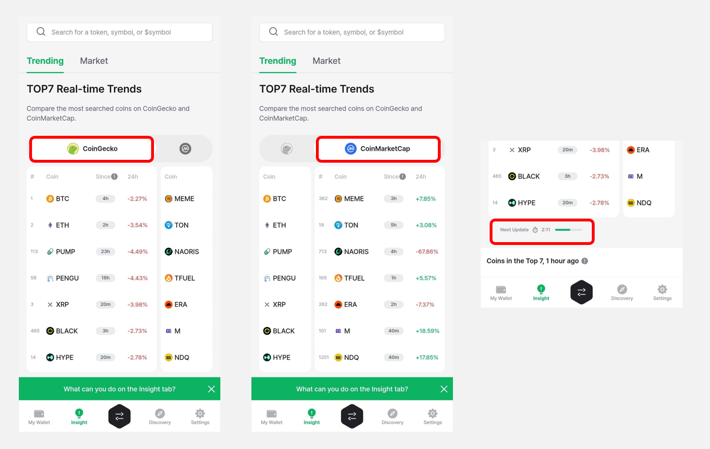

# Insight

Insight is a new service that **provides accurate information for asset management by intuitively checking the market trend of various cryptocurrency coins.**

Insight service provides a real-time updated **top 7 list of the most searched cryptocurrency coins on CoinGecko and CoinMarketCap.** You can also see real-time market trends, price changes, and detailed information for each coin, and make purchases easily and conveniently.

## Access the Insight

**1)** You can access the Insight service by touching the **"Insight"** tab on the bottom of the D'CENT app.

<figure><figcaption></figcaption></figure>

**2)** The Insight tab is structured as follows:

**Ⓐ** **Token Search Bar**: You can search for tokens by name, symbol, or ticker (e.g., `$BTC`).\
&#xNAN;**Ⓑ Market Cap**: Displays the total market cap of the global crypto market.\
&#x20;   **Bitcoin Dominance**: Displays the ratio of Bitcoin’s market cap to the total crypto market cap.\
&#x20;   **Fear & Greed Index**: A metric that reflects the overall sentiment of crypto investors.\
&#xNAN;**Ⓒ Trending**: You can compare the real-time top 7 trending tokens based on search data from CoinGecko and CoinMarketCap.\
&#xNAN;**Ⓓ** **Market**: Displays the top 100 tokens ranked by market cap.

<figure><figcaption></figcaption></figure>

## Top 7 Real-Time Trending List

**1)** When you access the Insight tab, you can see the **Top7 list of the currently most popular cryptocurrencies** on **CoinGecko and CoinMarketCap.**\
You can **easily switch between services by swiping left and right on the Top7 list screen** and compare the ranking of popular coins on each service.

The Top7 list is updated every **5 minutes on CoinGecko** and **every 10 minutes on CoinMarketCap**.

<figure><figcaption></figcaption></figure>

**2)** Numbers (%) next to the Top7 list display the **percentage change in price range the latest 24 hours.**\
If the same coin is in the Top7 list on both CoinGecko and CoinMarketCap, you can compare the percentage change in price on each service.

<figure><figcaption></figcaption></figure>

**3)** In the bottom of the Top7 list, displayed are lists of coins that ranked in the Top7 by time: **1 hour ago, 6 hours ago, 24 hours ago.**

**"Market trend"** indicates whether the coins that have entered the trending list in the last 6 hours are mostly **Large or Small Cap** .

<figure><figcaption></figcaption></figure>

## How to check coin information in Insight

You can select desired coins in the Top7 list to view coin information.

**1)** The Token Info screen is structured as follows:

**Ⓐ** **Current Price & Market Cap :** Displays the current token price and market cap.\
&#xNAN;**Ⓑ** **Chart Options** : You can select to display the chart below by either price or market cap.\
&#xNAN;**Ⓒ** **Top 7 Entry Point :** Indicates the time when the token entered the Top 7 trending list.\
&#xNAN;**Ⓓ** **Price Chart Interaction :** When you tap the price movement chart, you can check how the price and trading volume have changed over time.

<figure><figcaption></figcaption></figure>

By scrolling down the screen, you can view the token’s price movement over the past 24 hours.\
Under **Market Info**, you can check details such as **Market Cap**, **FDV (Fully Diluted Valuation)**, **24-hour trading volume**, **Circulating supply**, and **Total supply**.\
You can also find links to the token’s **official community**, **contract address**, and **website**.

<figure><figcaption></figcaption></figure>

**2)** Tap the **"Onchain"** tab to view the token’s blockchain transaction data.

**Ⓐ** **Market Info :** Provides data such as **market cap**, **FDV (Fully Diluted Valuation)**, **circulating supply**, and **maximum supply**.\
&#xNAN;**Ⓑ** **Trade Volume :** You can check the trade volume and count by **5 min / 1 hr / 6 hr / 24 hr intervals.**\
&#xNAN;**Ⓒ** **Trade History :** You can view a list of on-chain trade history by network for the selected token.

<figure><figcaption></figcaption></figure>

## Buy Tokens via Swap in the Insight

On the token detail screen in the Insight tab, you can tap the **"Swap"** button at the bottom to purchase the token directly via the D'CENT Swap service.


The **"Swap"** button may be disabled depending on the swap provider’s policy or current liquidity status.


<figure><figcaption></figcaption></figure>

Please refer to the guide below for how to use the Swap service.


[swap.md](swap.md)

