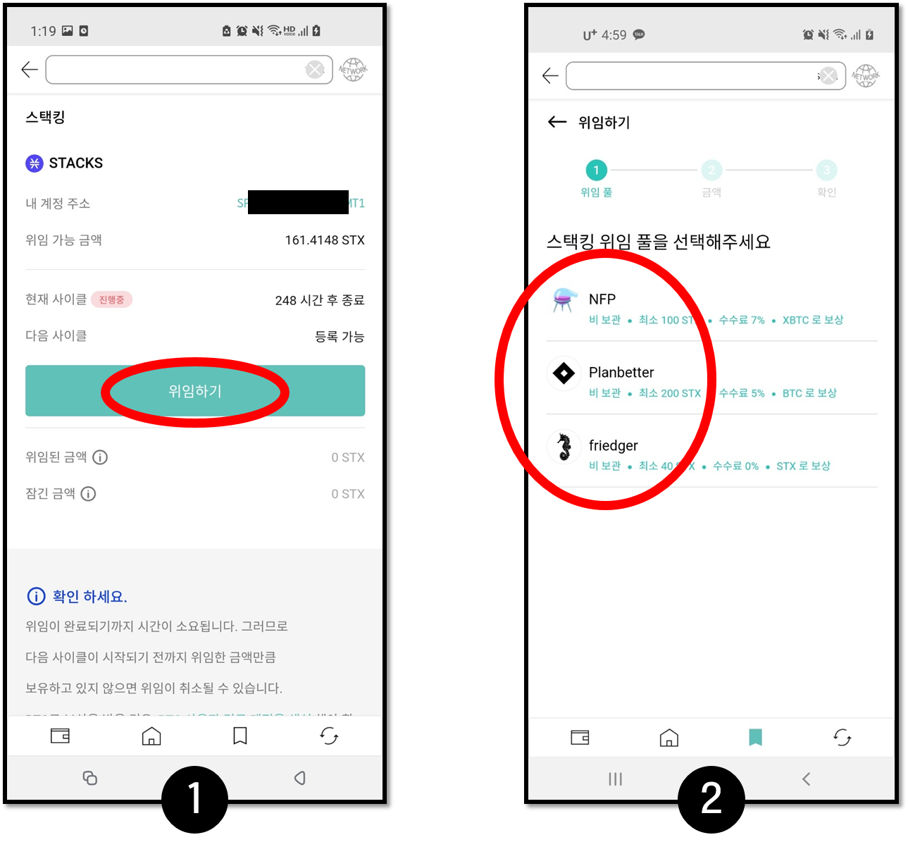
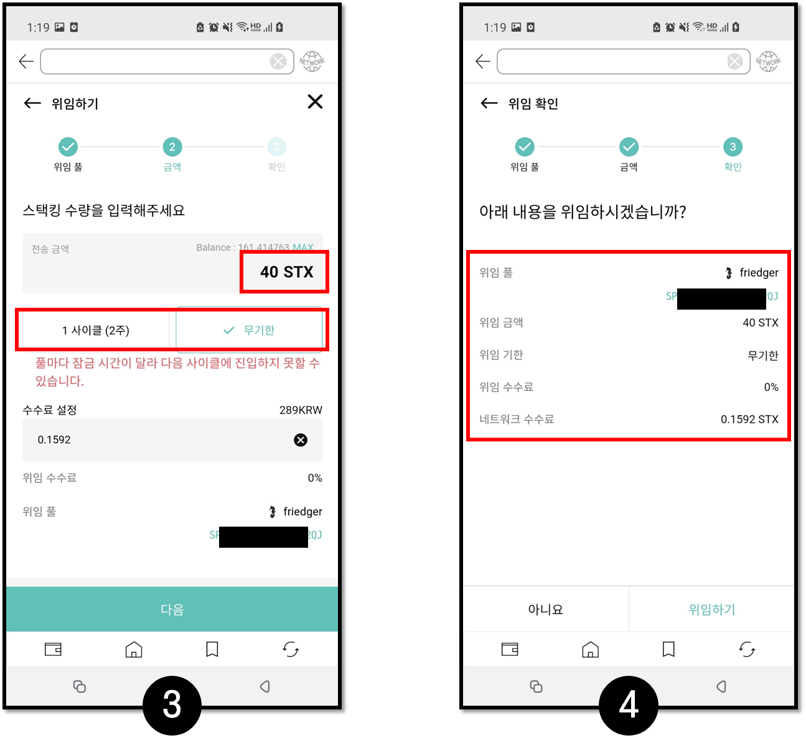
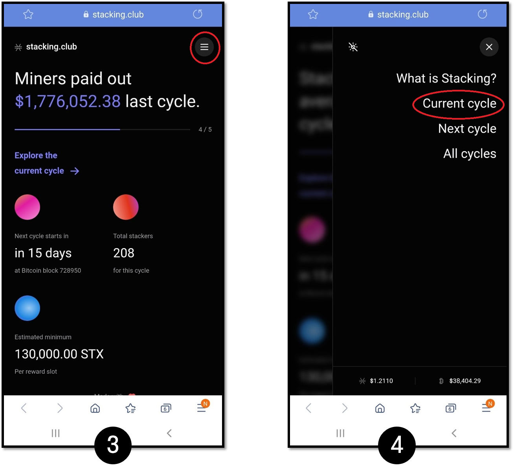
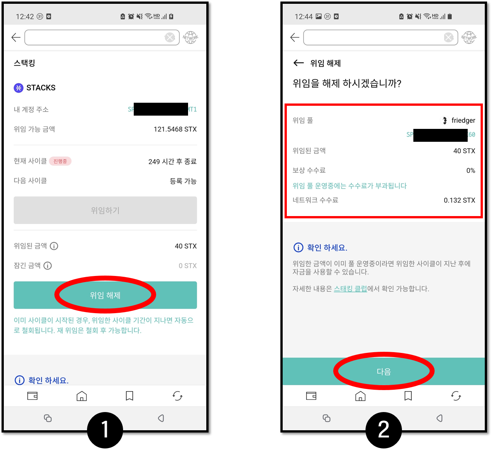

# 스택스 스택킹 위임 서비스

## **스택스 스택킹 가이드**&#x20;

스택스를 스태킹하여 보상으로 BTC, xBTC(wrapped BTC), 또는 STX를 획득 할 수 있습니다. 하지만 직접 스택킹을 하기 위해서는 상당히 많은 양의 스택스를 보유하고 있어야 가능함으로 소량의 스택스를 보유한 사용자는 스택킹 풀에 위임 할 수 있습니다.

**스택스 위임은 다음과 같습니다:**    &#x20;

1. 스택킹 풀을 운영 하는 곳에 보유한 스택스를 위임
2. 해당 풀에서 발생한 보상을 풀에 위임한 지분에 따라 보상을 받을 수 있게 합니다.

이때 운영 하는 풀에 따라 일정량의 수수료가 붙거나 BTC 또는 xBTC 대신 STX를 분배하기도 합니다.

디센트의 스택킹 서버스는 위임 풀에 스택스를 위임하는 과정을 도와 주고자 만들어 졌습니다.


_풀의 변경된 정보가 디센트 서비스에 바로 반영되지 않을 수 있으므로 **스택스를 풀에 위임하기 전에 해당 풀의 정보를 반드시 확인하세요**._


### **스택킹 기본 용어**&#x20;

* **사이클**: 스택스의 스택킹은 사이클이라는 주기로 관리됩니다. 1 사이클은 BTC 의 블록 생성 시간에 따라 변경될 수 있으나 평균적으로 2 주 입니다. 서비스내 현재 사이클은 현재 진행 중인 스택킹이 끝나는 시간을 의미합니다.\

* **위임된 금액**: 위임을 한 총 수량. _위임 풀에서 스택킹을 진행(잠금) 하지 않았으면 위임 금액은 사용자가 스택스를 다른 곳으로 전송 할 수 있지만 잔고가 위임 금액 이하가 되면 스택킹이 정상적으로 진행 되지 않습니다._\

* **잠긴 금액**: 위임 풀에서 위임된 스택스를 스택킹 하여 전송이 제한된 수량으로, 스택킹한 기간 동안은자금을 이동 할 수 없습니다.\

* **무기한 위임**: 위임 풀에서 최대 12 사이클(약 6 개월)동안 스택킹을 진행 할 수 있습니다. 무기한 위임 시에 중도 철회 가능하나 잠금 된 금액은 최대 12사이클 동안 전송이 불가할 수 있습니다.

### **스택스 위임 준비**


스택스 스택킹 위임 서비스는 앱 월렛의 경우 **앱 월렛 버전 v.5.10.1** / 지문 인증 지갑은 **펌웨어 버전 v2.16.7** 이상부터 서비스 이용이 가능합니다.


스택스를 위임 하기 위한 초기 링크는 스택스 계정의 ‘**계정 상세 거래내역**’ 페이지에 있습니다.

해당 링크를 클릭하면 디센트의 스택킹 위임 서비스 페이지로 이동 할 수 있습니다.

.jpg>)

### **스택스 위임**

먼저 위임 페이지 하단의 확인 사항을 정독 합니다.


_풀 마다 차이가 있으나 보통 현재 사이클 3일 전까지는 위임을 완료해야 풀 서비스 업체가 다음 사이클에 위임 금액을 스택킹 할 수 있습니다._


**1.** 위임 하기 버튼을 눌러 위임을 진행합니다.

**2.** 위임 풀을 선택합니다. 현재 3개의 풀이 리스트 되어 있으며 풀 서비스 업체의 사이트에서 보다 자세한 최신의 정보를 확인 할 수 있습니다.

* NFP Studio ([https://app.nfpstudio.io/stacking](https://app.nfpstudio.io/stacking))
* Planbetter ([https://planbetter.org/](https://planbetter.org/))
* Friedger ([https://pool.friedger.de/](https://pool.friedger.de/))


위임 풀 마다 위임 최소 수량이 존재하므로 스택스를 최소 수량 이상을 준비하세요. Friedger 풀의 경우 최소 40 STX가 필요하며 수수료 포함 약 41 STX가 필요합니다.


**3.** 위임 금액과 위임 기간을 설정 합니다. 위임 풀의 최소 수량 및 수수료를 확인 하세요.


1 사이클 위임의 경우 다음 2주 쿨다운 기간 동안 스택킹을 할 수 없습니다. 보상을 최대로 받으려면 무기한 위임을 하시는 것이 좋습니다. 단, 스택스는 최대 6개월 동안 잠길 수 있습니다.

주기적으로 풀 정보를 확인 하지만 위임 풀의 위임 주소가 변경 되었을 수 있습니다. 최신 풀의 정보가 일치하는지 확인하세요.


**4.** 위임 금액/위임 기한을 확인 한 후 서명을 진행 합니다.

위임이 거래가 처리되기 위해서는 약 30 분\~1 시간 정도의 시간이 걸립니다. 위임이 정상적으로 이루어지면 위임 금액을 확인 할 수 있습니다.


초기 페이지의 갱신을 위해서는 화면을 밑으로 드래그한 이후 놓으면 정보를 다시 조회 합니다.(화면을 아래로 쓸어 내리기)


### 스택스 위임 정보 확인

**1.** 위임 후 정상적으로 잠금 완료됐다면 아래 사진과 같이 위임 풀에 대한 정보가 제공됩니다.

.png>)

**2.** 스택킹 페이지 하단에 제공되는 **스택킹 클럽** 또는 [**https://stacking.club/**](https://stacking.club/) 클릭.

**3.** 스택킹 클럽 사이트에서 우측 상단 메뉴 버튼 클릭.

**4.** Current cycle 버튼 클릭.

**5.** Pools 버튼을 클릭하여 **1번 이미지**에서 제공되는 선택한 풀의 address와 같은 주소를 찾아 클릭.

**6.** 풀에서 내 STX 주소가 안 보인다면 하단에 있는 **Show all stackers** 클릭.

**7.** STX 주소를 찾으면 진입한 사이클, 위임 해제될 사이클 등의 정보를 확인하실 수 있습니다.

.png>)

### **스택스 위임 해제**

위임 이후 위임 해제를 진행 합니다. **스택킹이 이미 진행 중(잠금 금액이 존재)이라면 위임 해제를 하더라도 위임된 자금은 잠금 기간에는 사용할 수 없습니다.** 마찬가지로 위임을 해제 하더라도 보상은 해당 기간(사이클)이 지나면 각 풀에서 지정한 방식으로 지급됩니다.

**1.** 위임 해제 버튼 클릭

**2.** 정보 확인 후 서명을 진행 합니다.

### **BTC 보상 전용 계정 생성 방법**

BTC 로 보상을 주는 풀의 경우 아래 방법으로 생성한 비트코인 계정으로 보상이 지급됩니다.

.jpg>)

**1.** 설정 탭의 사용자 정의 경로 계정을 활성화 합니다.

**2.** 이후 계정 추가 에서 BTC 검색 후 보상을 위한 BTC의 계정 주소 **m/44’/5757’/0’/0/0**를 추가합니다.

Custom 계정에 대한 자세한 가이드는 [이곳](https://userguide.dcentwallet.com/v/kr/mobile-app/create-account/btc)을 통해 확인 가능합니다.
