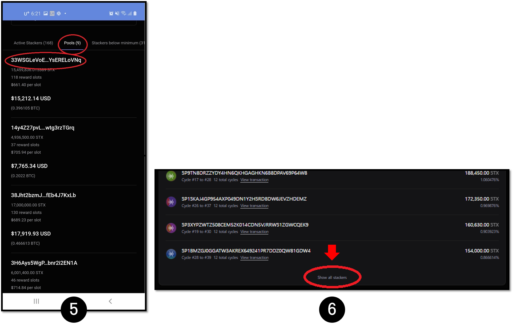

# Stacks Stacking Delegation Service

## Stacks Stacking guide

Users can earn BTC, xBTC(wrapped BTC), or STX token by stacking Stacks (STX).

However, stacking is only possible when the user is holding a fairly large amount of Stacks and this requirement does not scale for many small holders. Instead, users with a small amount of Stacks can delegate to the stacking pool.

**Stacks delegation is the following:**

1. Delegating the user's Stacks to the stacking pools operated by the third party.
2. Allows you to receive rewards from the pool according to the portion you have delegated to the pool.

Depending on the pool operated, a certain amount of fee is charged and you may receive STX instead of BTC or xBTC as your reward.

D'CENT Stacking Service was created to help users with the process of delegating Stacks to a delegation pool.


Any changed information from the pool may not be reflected immediately on the D'CENT service, it is the user's responsibility to check the information from the pool operators website before delegating Stacks to the pool.


### Stacking Basic Terms

* **Cycles:** Stacking of Stacks is managed in time periods called cycles. 1 cycle can change according to the block generation time of BTC, but on average is 2 weeks. The current cycle within the service means when the current stacking process will end.
* **Delegated Amount:** The total amount that has been delegated. If the delegation pool does not proceed with the locking of the delegation amount, the user can transfer Stacks to another place, but if the balance falls below the delegation amount, the stacking will not proceed normally.
* **Locked Amount:** The amount locked(non-transferrable) by delegating Stacks to a delegation pool. Locked funds cannot be moved during the stacked period.
* **Indefinite Delegation:** You can delegate Stacks for up to 12 cycles (about 6 months) in the delegation pool. **In the case of indefinite delegation, it is possible to withdraw mid-term. However, the locked amount may not be transferable for up to 12 cycles.**

### Preparing for Stacks delegation


The Stacks stacking delegation service is available for **App Wallet version v.5.10.1** / **Firmware version v2.16.7 or higher is required for the Biometric Wallet**.


The access link to delegate your Stacks can be found from the ‘**Account Details**’ page of your Stacks account. Clicking on this link will take you to D'CENT Stacking Delegation Service page.

### Stacks delegation

Before you proceed, make sure to read through the checklist at the bottom of the delegation page.


Each pool is different, but in general, the delegation must be completed by 3 days before the current cycle so that the pool provider can stack the delegation amount in the next cycle.


**1.** Click on the "Delegate" button to proceed with delegation.

**2.** Select a pool of your choice. Currently, there are 3 pool services that are listed. You can get full details of their service by visiting the websites. Make sure to regularly visit your pool provider's website to be updated on any changes they have made.

* NFP Studio ([https://app.nfpstudio.io/stacking](https://app.nfpstudio.io/stacking))
* Planbetter ([https://planbetter.org/](https://planbetter.org/))
* Friedger ([https://pool.friedger.de/](https://pool.friedger.de/))


There is a minimum amount of Stacks required by each delegation pool, so prepare more than the minimum amount of Stacks. For example, a minimum of 40 STX is required for the Friedger pool, you should prepare approximately 41 STX which includes any fees.


**3.** Set the delegation amount and the delegation period. Be sure to check your delegation amount meets the minimum required by the pool provider and check the fee amount.


1 cycle delegation will not allow stacking during the next 2 week cooldown period. We recommend doing indefinite delegation for maximum rewards. However, Stacks can be locked for up to 6 months.

Pool information is checked periodically, but the delegation pool may change the address without any notice. Make sure to check the information in the latest pool matches..


**4.** Check the delegation amount and delegation period before you proceed with signing.

It takes about 30 minutes to an hour for the delegation transaction to be processed. If the delegation is successful, you can check the delegation amount.


To refresh the page, you can press and drag down on the screen for the latest information.


### How to check Stacks delegation information

**1.** If the lock is completed normally after delegation, information about the delegation pool is provided as shown in the picture below.

**2.** Click on the **Stacking Club** or [**https://stacking.club**](https://stacking.club) available at the bottom of the Stacking page.

**3.** Click the **menu button** at the top right of the Stacking Club site.

**4.** Click the **Current cycle** button.

**5.** Click the **Pools** button. Search and click on the delegation pool address (ie: from the image 1) that you have delegated to.

**6.** Look for your STX address, click on **Show all stackers** at the bottom to see the full list.

**7.** From finding your STX address, you can check information such as the cycle entered and when the cycle will end for undelegation.

.png>)

### Stacks undelegation

Delegated funds can be undelegated. While the stacking is already in progress (the locked amount exists) and even if undelegation has been done, the balance in the wallet equaling to the amount of delegated funds cannot be used during the locked period. Similarly, even if the undelegation has been done, the rewards will be paid out in the manner specified by the each pool operator after that period (cycle) ends.

**1.** Click on "Undelegate" button.

**2.** Check the information before signing.

### **How to create custom account for BTC reward**

For the delegation pools that offer BTC as reward, you can create a custom BTC account as below.

**1.** From the Setting Tab, enable Custom Path Account.

**2.** Add a new account by searching for BTC. Add the **Bitcoin –custom path(BTC)** found at the bottom of the list.

**3.** For the BTC reward account the address path is **m/44’/5757’/0’/0/0**.

You can find detailed information on creating Custom account from [here](https://userguide.dcentwallet.com/mobile-app/create-account/how-to-add-a-custom-path-btc-account).
