# Swap

D'CENT Wallet provides SWAP service through 1inch DEX, an aggregator that provides be the rate for swapping ERC20 tokens issued on the same network.


Swap service is available for D'CENT App version **5.16.0 or higher**.


### Select Network

**1)** As you access the swap service, available main networks will be displayed. Availability of  networks listed on D’CENT Wallet may change based on the service provider’s conditions. **Select** the network you want to proceed with.

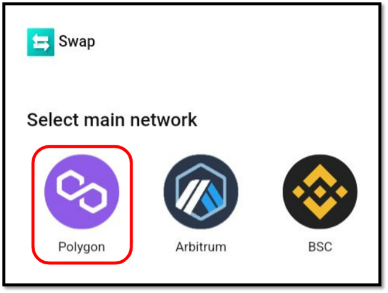

**2)** After a network is selected, a green confirmation button (✅) will appear on the network icon. To proceed with the selected network, click the **Next** button.

.png>)

**3)** Connect your wallet. You can simply click **Connect** to connect. At least one account must exist on the selected network. You can change the main network account by pressing <**Switch Account**>.

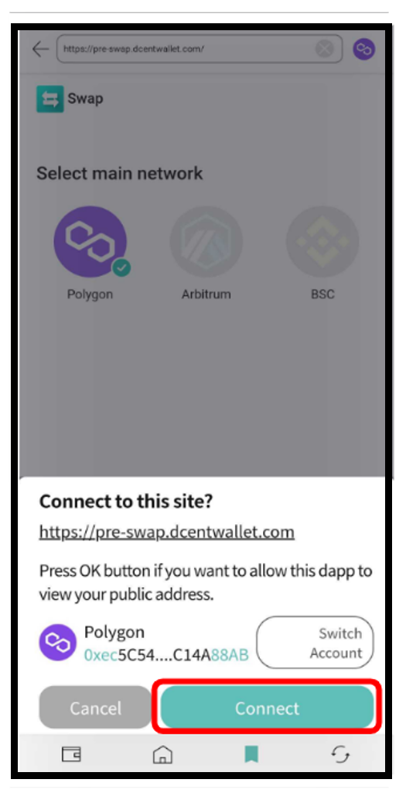

## **Start Swapping**

**1)** Select the cryptocurrency to be swapped. Click the left magnifying glass button to see the tokens you can choose from. Select the desired account by clicking on it.

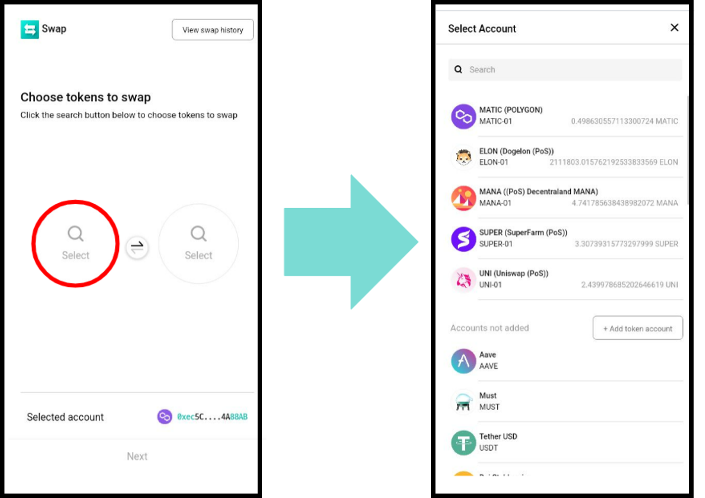

You can also use the search bar to find the token you are looking for.

.png>)

Additionally, you can easily add the desired token account by clicking on the token in the list of accounts you do not own.

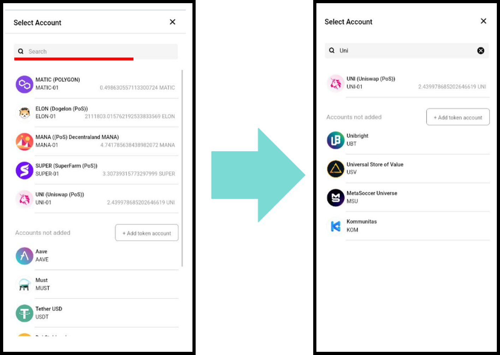

**2)** If the token to receive on the right has been determined, check once again that the token to send and the token to receive are in the correct position. If the order is wrong, you can swap the positions of the two tokens by pressing the button in the center. If everything is ready, click the Next button at the bottom.

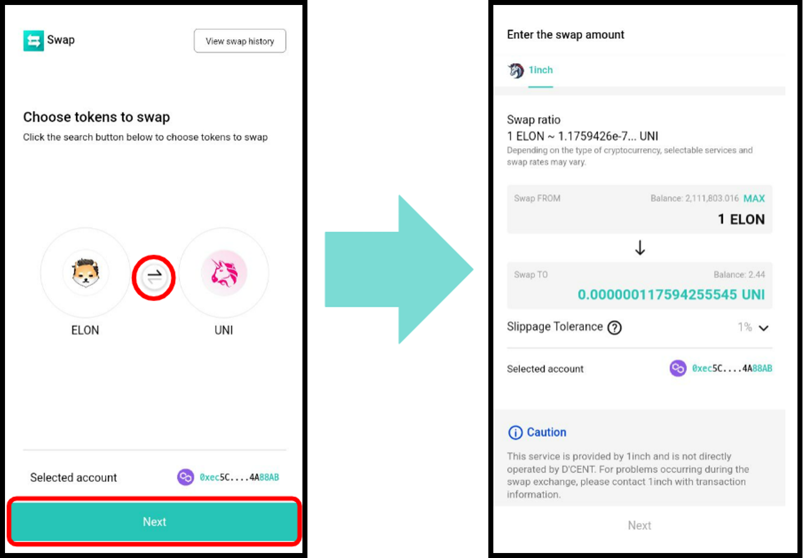

**3)** If you click Next, you can set the service and amount to proceed with the swap. In Ⓐ, select the service to proceed with the swap. In Ⓑ, you can check the swap ratio. In Ⓒ, you can see the amount of cryptocurrency you are sending and the expected amount you will receive. You can set the maximum swappable amount for the selected token by pressing the Ⓓ button.

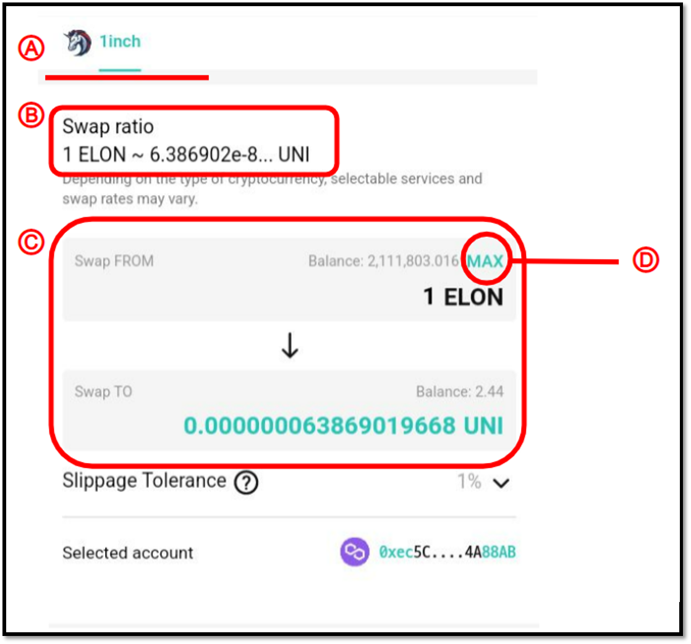

**4)** The default value of slippage is 1%. Press Ⓐ to set detailed settings for slippage. In addition to the recommended default slippage values of 1%, 2%, and 3%, you can set the slippage to a higher value by pressing Ⓑ. The maximum slippage that can be set is capped to 49%. After confirming that the account selected below is correct, read the notes and check Ⓒ. Next, to give the service permission to swap, press Ⓓ to execute authorization.

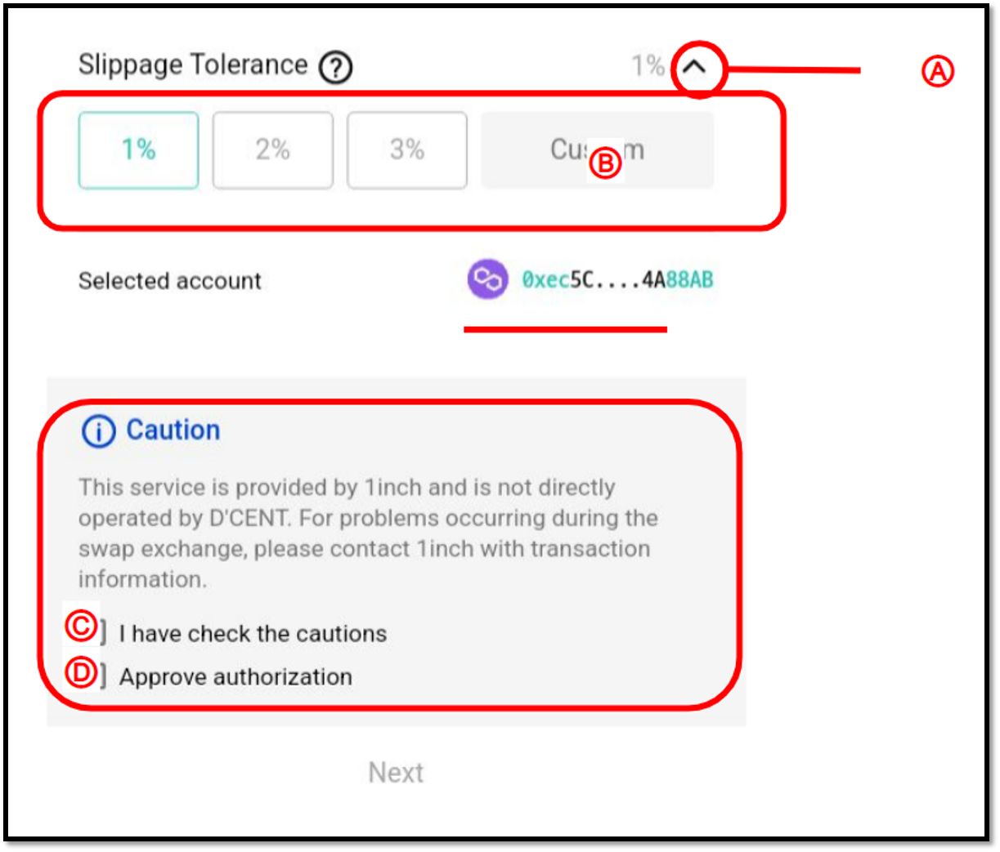

**5)** After you tick on Approve Authorization box, you will see the following screen shortly. Confirm the contract address, and then proceed with signing. Once authorization is done, **the token will no longer need authorization again.**

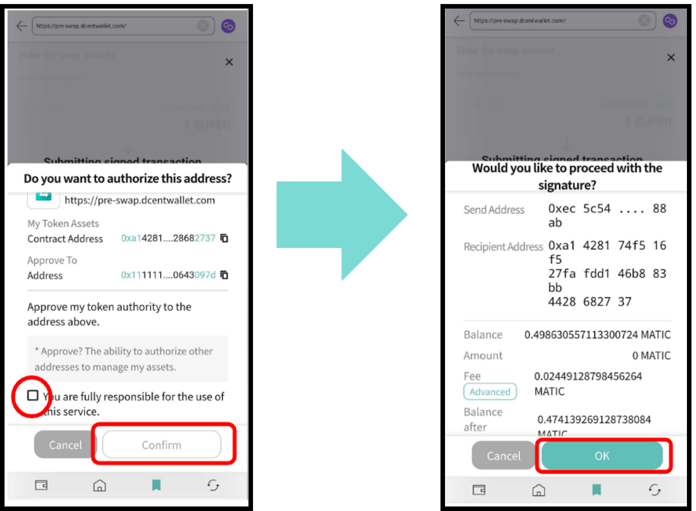

**6)** After reviewing the information to be signed once more, click the Swap button to finally proceed with the swap.

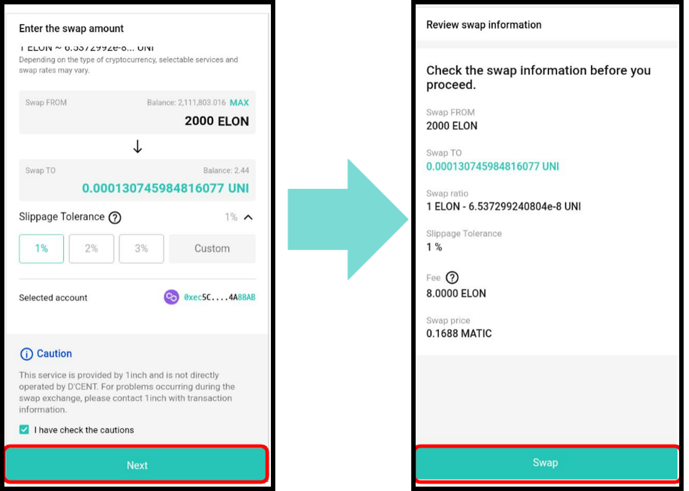

**7)** Check once again that the information to be signed is correct, and proceed with the signature. If it is successfully signed, you can see the message 'Swap request has been transmitted'. You can check the actual transaction information from a Block Explorer by clicking on the link “Check from Polygon explorer” just below the Confirm button.

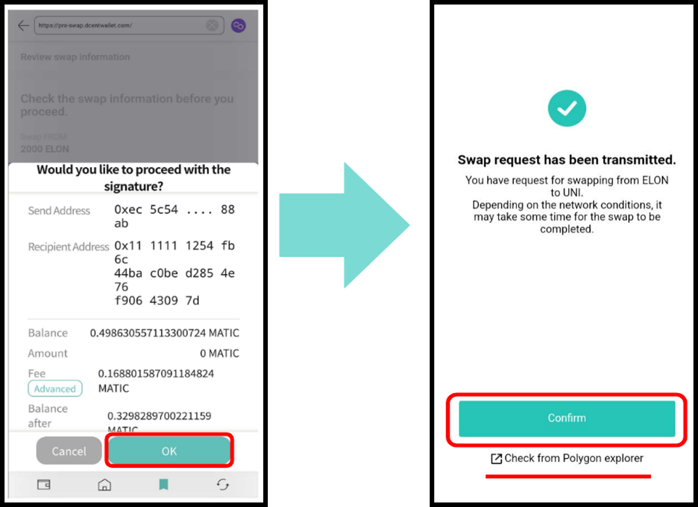

**8)** If you click Confirm after signing, you will be taken back to a screen where you can select a cryptocurrency to swap. Now you can easily check the progress of the swap request that’s been transmitted by clicking **View Swap History** at the top. You can press the refresh button to get the latest status of the swap request in progress. If the swap has been completed, you will see “Completed” instead of “Pending” as the status.

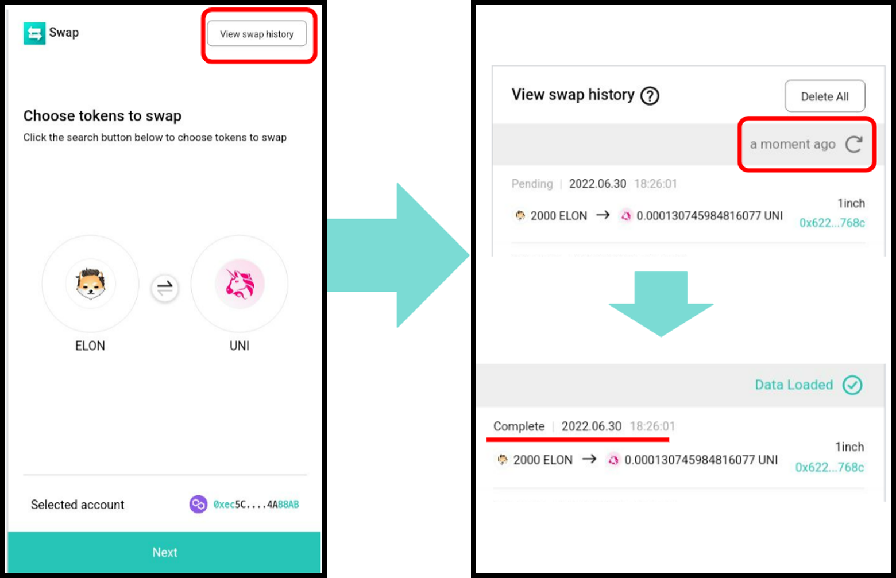
