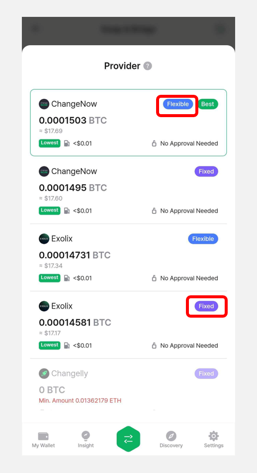

# Swap

Swap service allows you to quickly and easily exchange one cryptocurrency for another.

D'CENT Wallet's Swap service enables seamless crypto exchanges across various blockchains. To facilitate this, it integrates with aggregators such as 1inch, OKX, ChangeNOW, and Changelly.

One of the key advantages of D'CENT Swap is that it provides bridging, cross-chain swaps, and regular swaps all within a single interface. For example, you can swap USDT on the Ethereum network for USDT on the Polygon network effortlessly.

## Access the Swap service

**1)** You can access the Swap service through the following three methods:

* ① D'CENT App → Tap the **"⇄(Swap)"** button at the top of the \[My Wallet] tab.
* ② D'CENT App → In the \[My Wallet] tab, select the coin account you added → Tap the **"⇄(Swap)"** button.
* ③ D'CENT App → Tap the **"⇄"** icon in the bottom Global Navigation Bar (GNB).
* ④ D'CENT App → In the \[Insight] tab, open the detailed view of a coin → Tap the **"Swap"** button.

<figure><figcaption></figcaption></figure>

**2)** When you access the Swap service, a screen will appear where you can select the **From token (the token you are sending)** and the **To token (the token you will receive)**.

<figure><figcaption></figcaption></figure>

## **Choosing a Token to Swap**

**1)** Select the token to send in the **From** section. Only tokens that are currently held in your wallet can be selected in the From field.

For each token, the network, token account name, and available balance will be displayed.

To change the sending token, tap the token account name as shown in the image below.\
You can either search for a token or select one from the list.

<figure><figcaption></figcaption></figure>

&#x20;

**2)** In the **To** section, select the token you want to receive through the swap.

Just like in the From section, tapping the token account name will open a popup where you can choose a token.

If you want to select a token that is not already added to your wallet, you can either choose it from the **"To Token"** list or enter the token name in the search box.

<figure><figcaption></figcaption></figure>

## Entering Swap Amount and Selecting a Service Provider

**1)** Select the tokens to swap in the From (sending token) and To (receiving token) sections. **Enter the amount** of the token you wish to swap in the **From** section.

<figure><figcaption></figcaption></figure>


Each token selected in the To (receiving token) section has a **minimum required amount** for the swap. Please check the displayed minimum amount before proceeding.


<figure><figcaption></figcaption></figure>

**2)** After entering the amount in the **From** (sending token) section, the estimated amount and value of the **To** (receiving token) will be displayed.

You can also check the service provider offering the quote, the swap rate, and the estimated network fee.

<figure><figcaption></figcaption></figure>

By tapping the displayed service provider, you can view other supported liquidity providers and select a different one that offers a better swap rate or is recommended for your transaction.

<figure><figcaption></figcaption></figure>


The fees required for swapping include service provider fees from platforms such as OKX and 1inch, as well as **network fees (gas fees) for executing transactions on the blockchain.**

D'CENT does not charge any additional fees for using the swap service.


**3)** If the receiving token is not yet added to your D'CENT wallet, an **"Add Account"** button will appear.\
Select the account that will cover the network fee, enter a name for the new account, and tap **"Add Account"** to create the token account.

<figure><figcaption></figcaption></figure>

&#x20;

## Slippage or Exchange Rate Settings

**1)** **If the selected quote is from a decentralized exchange (DEX) provider.**

You can check the **Slippage** information at the bottom of the screen.

Slippage refers to the difference between the expected price at the time of order placement and the actual price at which the transaction is executed. It typically occurs in highly volatile or low-liquidity markets. By default, the optimized slippage rate for the transaction is recommended and displayed.

Users can manually adjust the slippage settings. In addition to the preset options of **0.5%, 2%, and 5.5%**, you can set a custom value anywhere between **0.01% and 50%.**


When trading meme coins, increasing the slippage tolerance improves the likelihood of a successful transaction. Additionally, if a previous transaction failed, raising the slippage setting can help ensure the trade is completed.


<figure><figcaption></figcaption></figure>

**2)** **If the selected quote is from a centralized exchange (CEX) provider.**

You can check the exchange rate information. In this case, there are two exchange rate options:

* **Flexible (Variable)**: The rate may change based on market fluctuations.
* **Fixed**: The rate is locked in at the time of transaction confirmation.

<figure><figcaption></figcaption></figure>

## Approve Token

**1)** If the token selected in the From field is based on the ERC-20 standard and the transaction is being processed through a decentralized exchange (DEX), the **"Approve"** button will appear instead of the **"Swap"** button. You must first tap **"Approve"** to authorize the token before proceeding with the swap.

This approval step allows the DEX service provider to access the token for swapping. \
For example, if the quoted provider is **1inch**, you will need to approve access to the token for **1inch** in order to proceed with the swap.

<figure><figcaption></figcaption></figure>

**2)** Tap the **"Approve"** button, check the **"Confirmed."** box on the next screen, and then tap **"Confirm"**.\
Review the transaction signature details, tap **"Approve"**, and complete the signature by authenticating with your fingerprint or PIN in the wallet.

<figure><figcaption></figcaption></figure>

**3)** After the approval is complete, re-enter the amount to swap. If the same service provider (e.g., **1inch**) is selected in the quote again, the **"Swap"** button will now appear.

The provider will also be marked as **"Approved"** in the provider list.

<figure><figcaption></figcaption></figure>

## **Sign the Transaction and Complete the Swap**

**1)** Once you have completed the token approval, tap the **"Swap"** button. Next, review the transaction details and tap **"Confirm"** or **"Send"**.&#x20;

To complete the transaction, check the signature request and authorize it using your fingerprint or PIN in the wallet.

<figure><figcaption></figcaption></figure>

**2)** After signing the transaction, tap **"Swap History"** to check the status of the swap.

<figure><figcaption></figcaption></figure>

**3)** If the status shows **"Completed"**, you can view the swapped cryptocurrency in the **"My Wallet"** tab.

<figure><figcaption></figcaption></figure>


If the swap status is **"Pending"** or **"Failed"**, or even if it shows as **"Completed"** but the cryptocurrency has not been received, you should contact the service provider using the **"Transfer TXID"** or the **"Exchange TXID"** (for ChangeNow, Changelly, Exolix).

You can find the service provider information and the corresponding TXID in the **"Swap Detail"** screen.


<figure><figcaption></figcaption></figure>


For any inquiries regarding service usage, please first check the answers in our Customer Support Center below.

* [ChangeNow](https://support.changenow.io/hc/en-us)
* [Changelly](https://support.changelly.com/en/support/home)
* [1inch](https://help.1inch.io/en/)
* [Exolix](https://exolix.com/contact)
* [ButterSwap](https://docs.butterswap.me/contact)
* [SushiSwap](mailto://Truda@sushi.com)
* [SwapScanner](mailto://contact@swapscanner.io)
* [LiFi](https://discord.gg/jumperexchange)
* [Rubic](https://docs.rubic.finance/contacts/support)



Please note that D'CENT Wallet only acts as a bridge to external services (dApps) by providing an intuitive swap interface. D'CENT is not directly responsible for any risks that may arise from using these 3rd party services.

