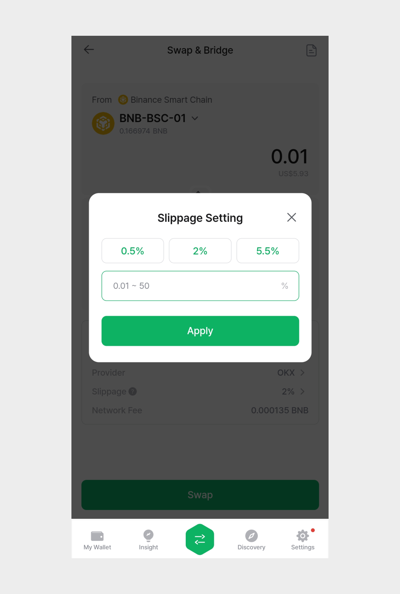
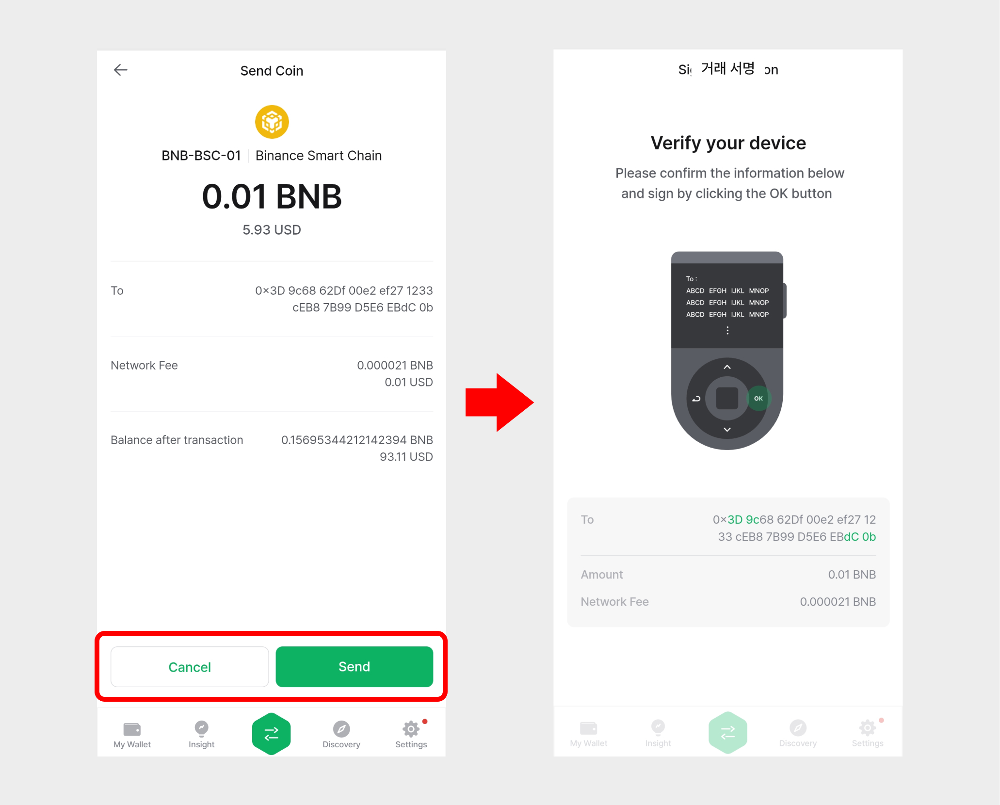
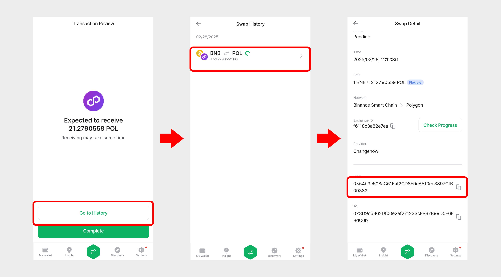

# Swap

Swap service allows you to quickly and easily exchange one cryptocurrency for another.

D'CENT Wallet's Swap service enables seamless crypto exchanges across various blockchains. To facilitate this, it integrates with aggregators such as 1inch, OKX, ChangeNOW, and Changelly.

One of the key advantages of D'CENT Swap is that it provides bridging, cross-chain swaps, and regular swaps all within a single interface. For example, you can swap USDT on the Ethereum network for USDT on the Polygon network effortlessly.


Swap service is available for D'CENT App version 7.4.0 or higher.


## Access the Swap service

**1.** You can access the Swap service through the following three methods:

* ① D'CENT App → Tap the "Swap" button at the top of the \[My Wallet] tab.
* ② D'CENT App → In the \[My Wallet] tab, select the coin account you added → Tap the "Swap" button.
* ③ D'CENT App → Tap the "Swap" icon in the bottom Global Navigation Bar (GNB).
* ④ D'CENT App → In the \[Insight] tab, open the detailed view of a coin → Tap the "Swap" button.

<figure><figcaption></figcaption></figure>

**2.** When you access the Swap service, a screen will appear where you can select the From token (the token you are sending) and the To token (the token you will receive).

<figure><figcaption></figcaption></figure>

**3.** In the From (sending token) section, you will see the connected main network information, the token account name, and the balance of the selected token in that account.

To change the sending token, tap the token account name as shown in the image below. You can then search for the desired token or select one from the list.

<figure><figcaption></figcaption></figure>


In the sending token popup, you can only select token accounts that have already been added to your wallet.


&#x20;

**4.** In the To (receiving token) section, tapping the token account name will open a popup where you can select a token.

If you want to select a new token that is not already added to your wallet, tap 'More' to choose a different network or enter the token name in the search bar to find and select it.

<figure><figcaption></figcaption></figure>

If you have selected a new token, tap the "Add Account" button. Then, choose the account that will cover the network fee, enter an account name, and tap "Create" to add the new token account.

<figure><figcaption></figcaption></figure>

&#x20;

## Start Swapping

**1.** Select the tokens to swap in the From (sending token) and To (receiving token) sections. Enter the amount of the token you wish to swap in the From section.


Each token selected in the To (receiving token) section has a minimum required amount for the swap. Please check the displayed minimum amount before proceeding.


<figure><figcaption></figcaption></figure>

**2.** After entering the amount in the From (sending token) section, you can check the amount and value of the To (receiving token).

Among the supported liquidity providers, the swap interface will display the best available rate and recommend the optimal provider for your transaction.

<figure><figcaption></figcaption></figure>


The fees required for swapping include service provider fees from platforms such as OKX and 1inch, as well as network fees (gas fees) for executing transactions on the blockchain.

D'CENT does not charge any additional fees for using the swap service.


**3.** If the selected quote is from a decentralized exchange (DEX) provider, you can check the slippage information at the bottom of the screen.

Slippage refers to the difference between the expected price at the time of order placement and the actual price at which the transaction is executed. It typically occurs in highly volatile or low-liquidity markets. By default, the optimized slippage rate for the transaction is recommended and displayed.

Users can manually adjust the slippage settings. In addition to the preset options of 0.5%, 2%, and 5.5%, you can set a custom value anywhere between 0.01% and 50%.

<figure><figcaption></figcaption></figure>


When trading meme coins, increasing the slippage tolerance improves the likelihood of a successful transaction. Additionally, if a previous transaction failed, raising the slippage setting can help ensure the trade is completed.


**4.** If the selected quote is from a centralized exchange (CEX) provider, you can check the exchange rate information. In this case, there are two exchange rate options:

* Flexible (Variable): The rate may change based on market fluctuations.
* Fixed: The rate is locked in at the time of transaction confirmation.

<figure><figcaption></figcaption></figure>

**5.** After reviewing all the quote details, tap the 'Swap' button. Next, review the transaction details and tap 'Confirm' or 'Send'.

<figure><figcaption></figcaption></figure>


If a transaction is delayed or fails, you can contact the exchange using the displayed Exchange ID.

To check the 'Exchange ID', go to the Transaction Review screen or tap the icon on the right of the Swap main screen to access the Transaction History.


<figure><figcaption></figcaption></figure>

**6.** After reviewing the sending token amount and value, receiving token amount, and network fee, tap 'Next' or 'Send'. Once you verify the final signing details, sign the transaction in your wallet to complete the swap request.

<figure><figcaption></figcaption></figure>


For some swaps, tokens must be sent to a centralized exchange, requiring a transaction signature for the transfer.


During this process, you can tap the 'View Details' button to check the swap history.

<figure><figcaption></figcaption></figure>

Once the swap is completed, you can tap the TXID on the swap details screen to view the actual transaction information on a Block Explorer.

&#x20;

7\) You can now check the swapped cryptocurrency in the 'My Wallet' tab.

<figure><figcaption></figcaption></figure>


For any inquiries regarding service usage, please first check the answers in our Customer Support Center below.

* [ChangeNow](https://support.changenow.io/hc/en-us)
* [Changelly](https://support.changelly.com/en/support/home)
* [1inch](https://help.1inch.io/en/)
* [OKX Swap / Cross Chain](https://www.okx.com/help)



Please note that D'CENT Wallet only acts as a bridge to external services (dApps) by providing an intuitive swap interface. D'CENT is not directly responsible for any risks that may arise from using these 3rd party services.

