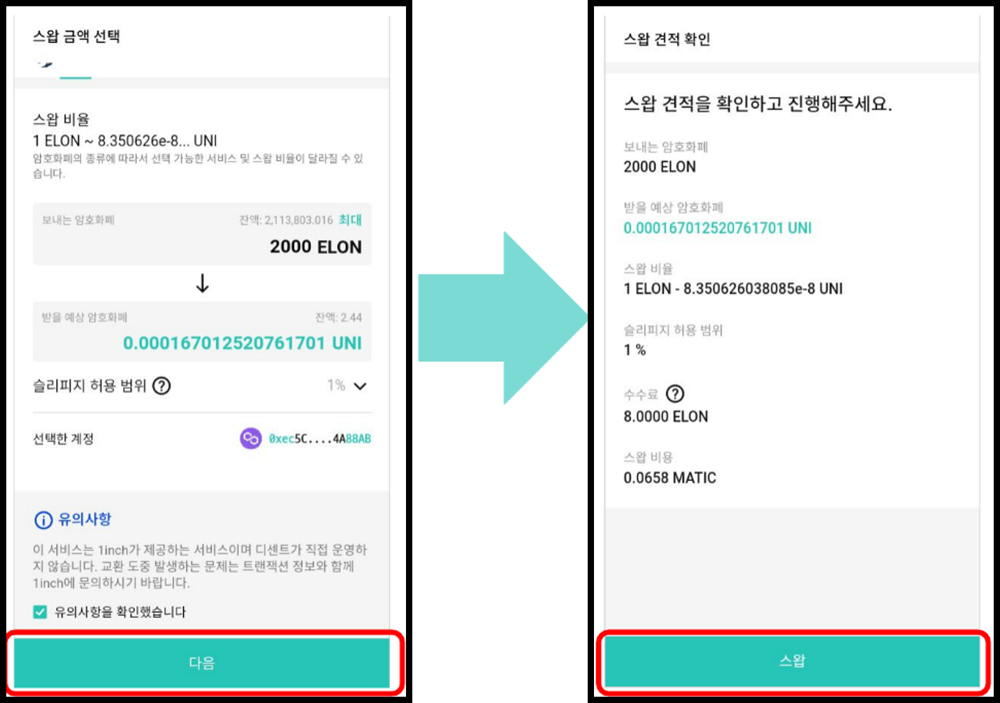

# 스왑 (Swap)

디센트에서 제공하는 SWAP 서비스는 1Inch(이하 원인치)와 같은 aggregator를 이용하여 최적의 효율로 **같은 네트워크 내의** erc20 토큰을 바꾸어줍니다.


해당 서비스를 이용하기 위해서는 **5.16.0 이상의 앱버전**이 필요합니다.


### **네트워크 선택** 

**1)** 스왑 서비스에 접속하면 이용 가능한 메인 네트워크들이 표시됩니다. 네트워크 종류는 자사 및 서비스 제공자의 상황에 따라 달라질 수 있습니다. **** 이용하고자 하는 네트워크를 선택합니다.

.png>)

**2)** 네트워크가 선택되면 잠시 후 네트워크 아이콘 위에 초록색 확인 버튼( ✅)이 생성됩니다. 선택된 네트워크가 맞는지 확인 후 다음 버튼을 클릭합니다.

**3)** 지갑을 연결합니다. 허용을 눌러서 간단히 연결할 수 있습니다. 선택한 네트워크에 한 개 이상의 계정이 존재해야 합니다. <연결 계정 변경> 을 눌러 메인 네트워크 계정을 변경할 수 있습니다.

## **토큰 스왑 진행하기**  

**1)** 스왑을 진행할 암호화폐를 선택합니다. 왼쪽 돋보기 버튼을 누르면 선택할 수 있는 토큰들이 보입니다. 원하는 계정을 클릭하여 선택합니다.

.png>)

빠른 토큰 선택을 위하여 검색란를 이용할 수 있습니다.

.png>)

또한 보유하지 않은 계정리스트에 있는 토큰을 클릭하여 원하는 토큰 계정을 쉽게 추가할 수 있습니다.

.png>)

**2)** 오른쪽에 있는 받을 토큰까지 정해졌다면 다시 한 번 보낼 토큰과 받을 토큰의 위치가 맞는지 확인합니다. 만약 순서가 잘못되었다면, 가운데 버튼을 눌러 두 토큰의 위치를 바꿀 수 있습니다. 모든 것이 완벽하다면, 하단의 다음 버튼을 눌러주세요.

**3)** 다음을 누르면 스왑을 진행 할 서비스와 금액을 설정할 수 있습니다. Ⓐ 에서 스왑을 진행 할 서비스를 선택합니다. Ⓑ 에서 스왑 비율을 확인할 수 있습니다. Ⓒ 에서 보내는 암호화폐의 양과 받을 예상 금액을 알 수 있습니다. Ⓓ 버튼을 눌러서 선택한 토큰에서 스왑이 가능한 최대 금액으로 설정할 수 있습니다.

**4)** 슬리피지의 기본값은 1%입니다. Ⓐ 를 눌러서 슬리피지를 상세 설정할 수 있습니다. 1%, 2%, 3% 의 추천되는 슬리피지 기본값이외에도 Ⓑ 를 눌러서 더욱 높은 값으로 슬리피지를 설정할 수 있습니다. 슬리피지는 최대 49% 까지 설정 가능합니다. 아래 선택한 계정이 맞는지 다시 한 번 확인 후, 유의 사항을 읽고 Ⓒ 에 체크합니다. 다음으로 서비스에게 스왑할 권한을 부여하기 위해 Ⓓ 를 눌러서 권한 부여를 실행합니다.

**5)** 권한 부여를 누르면 잠시 후 다음과 같은 화면을 보게되는데, 컨트렉트 주소를 확인 한 후 서명을 진행합니다. 한 번 권한 부여를 진행하면 해당 토큰은 **다시 권한 부여를 할 필요가 없게됩니다**.

**6)** 서명을 진행 할 정보들을 다시 한 번 확인 후 스왑버튼을 눌러 최종적으로 스왑을 진행합니다.

**7)** 서명할 정보들이 맞는지 다시 한 번 확인하고, 서명을 진행합니다. 정상적으로 서명이 되었다면 스왑 전송 요청 완료라는 메세지를 확인할 수 있습니다. 아래 폴리곤 스캔에서 확인하기 버튼을 눌러서 실제 트랜잭션 정보를 Block Explorer 로 확인할 수 있습니다.

**8)** 서명 완료 후 확인을 누르면 다시 스왑할 암호화폐를 선택하는 화면을 볼 수 있는데 상단의 스왑 내역보기를 눌러 현재 전송된 스왑 요청의 진행 사항을 쉽게 확인할 수 있습니다. 오른쪽 상단의 **갱신** 버튼을 눌러 스왑내역들을 새로고침하면 현재 진행중인 스왑 요청의 상태가 갱신되며, 스왑이 완료되면 아래 상태바에서 완료라는 문자를 확인할 수 있습니다.

