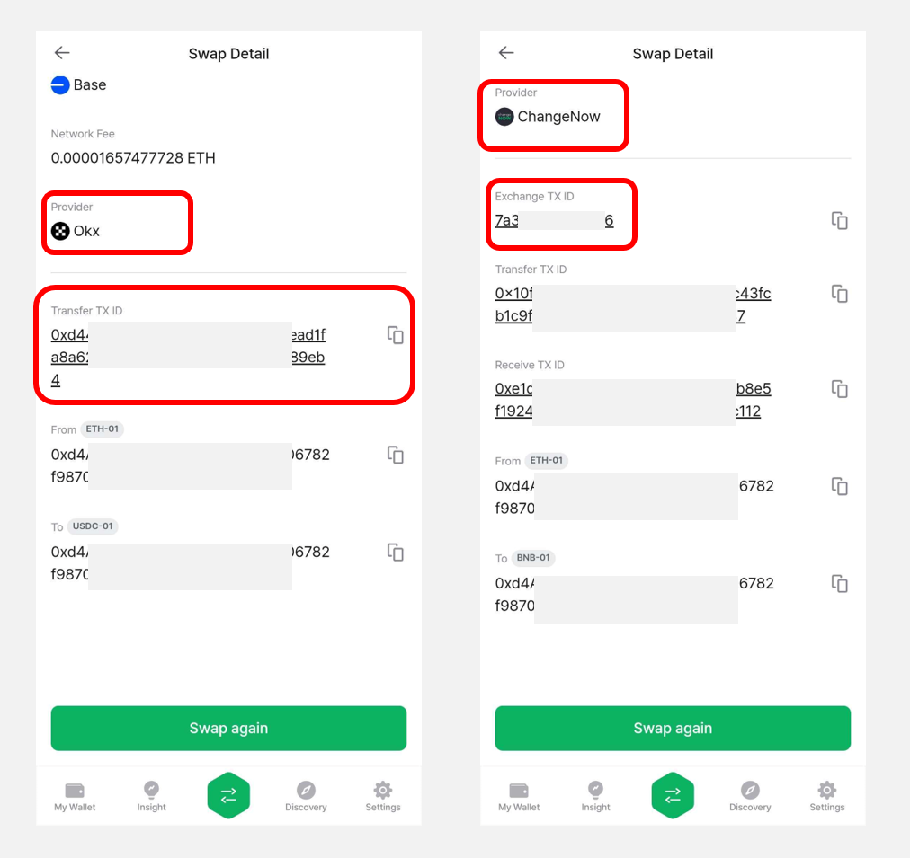

# 스왑 (Swap)

스왑(Swap) 서비스는 내가 가지고 있는 하나의 암호화폐를 다른 암호화폐로 쉽고 빠르게 교환할 수 있는 서비스입니다.

디센트에서 제공하는 스왑(Swap) 서비스는 1Inch(이하 원인치) aggregator를 이용하여 최적의 효율로 **같은 네트워크 내의** erc20 토큰을 다른 토큰으로 바꾸어줍니다.


해당 서비스를 이용하기 위해서는 **5.16.0 이상의 앱버전**이 필요합니다.


## 스왑 서비스 접속 

**1)**  스왑 서비스는 디센트 앱 **"My Wallet"** 탭 상단 혹은 **"Discovery"** 탭에서 접속할 수 있습니다.

**2)** 스왑 서비스에 접속하면 연결된 메인 네트워크 정보와 지갑 주소, 보유한 암호화폐의 잔액이 표시됩니다.

**3)** 메인 네트워크 변경을 하려면 아래 그림과 같이 더보기 버튼을 눌러 원하는 네트워크로 변경할 수 있습니다.

<figure><figcaption></figcaption></figure>

**4)** 네트워크 선택 팝업이 나타나면 이용 가능한 메인 네트워크들이 표시됩니다. 네트워크 종류는 자사 및 서비스 제공자의 상황에 따라 달라질 수 있습니다. 화면을 위로 스크롤 하여 이용하고자 하는 네트워크를 선택합니다.

<figure><figcaption></figcaption></figure>

만약 선택한 네트워크의 계정이 존재하지 않다면 아래 그림과 같이 **+ 버튼**을 눌러 디센트 지갑에 계정을 추가할 수 있습니다.


지문인증형 지갑을 사용한다면 반드시 하드웨어 지갑이 연결된 상태이어야 합니다.


<figure><figcaption></figcaption></figure>

## **토큰 스왑 진행하기**  

**1)** 스왑을 진행할 암호화폐를 선택합니다.  **Send** 는 사용자가 가지고 있는 암호화폐이며, 더보기 버튼을 눌러 스왑할 토큰을 선택할 수 있습니다.

가지고 있는 토큰을 선택해주세요.

<figure><figcaption></figcaption></figure>

**2)** Send 에서 암호화폐 토큰을 선택하였다면 **Get** 에서 스왑으로 받고자 하는 암호화폐 토큰을 선택합니다.

<figure><figcaption></figcaption></figure>

빠른 토큰 선택을 위하여 검색란을 이용할 수 있습니다.

<figure><figcaption></figcaption></figure>

**3)** 스왑으로 받고자 하는 토큰까지 선택을 완료 하였다면 **Send** 에서 스왑할 토큰의 수량을 입력해주세요. **Ⓐ** 에서 숫자를 직접 입력할 수 있고 **Ⓑ** 에서 비율로 수량을 선택할 수 있습니다.

수량 입력을 완료하였다면 **Get** 항목의 **Ⓒ** 에서 받을 토큰의 수량을 확인할 수 있고 **Ⓓ** 에서 예상 수수료(가스비)를 확인할 수 있습니다.

**4)** 받을 토큰의 예상 수량까지 확인하였다면 슬리피지를 설정할 수 있습니다.&#x20;

슬리피지는 **"주문 시점과 확인 시점 사이의 가격이 변동되는 현상"**&#xC744; 말하며, 기본값은 1%입니다.  \
1%, 2%, 3% 의 추천되는 슬리피지 기본값 이외에도 더욱 높은 값으로 슬리피지를 설정할 수 있습니다. 슬리피지는 최대 49% 까지 설정 가능합니다.

**Ⓐ** 에서 슬리피지까지 설정을 하였으면 **Ⓑ** 에서 **"구매하기"** 버튼을 누릅니다.

**5)** 다음으로 서비스에게 스왑할 권한을 부여하기 위해 토큰 컨트랙트 주소의 권한을 부여해야 합니다.\
권한 부여 대상의주소를 확인 한 후 서명을 진행합니다. 한 번 권한 부여를 진행하면 해당 토큰은 **다시 권한 부여를 할 필요가 없습니다.**

<figure><figcaption></figcaption></figure>

**6)** 권한을 부여한 후 최종 견적을 확인하게 됩니다.&#x20;

최종 견적에 이상이 없다면 **"위 사항을 확인했습니다."** 항목을 체크하여 **"확인"** 버튼을 누릅니다.\
이후 서명 정보들이 맞는 지  다시 한번 확인을 한 후 "**승인" 버**튼을 누릅니다.

**7)** 최종 서명 정보를 확인한 후 지갑에서 거래의 서명을 진행하면 스왑 요청이 완료되며, 수령할 토큰의 예상 수량을 확인할 수 있습니다.

이때 **"거래 내역은 어디에서 확인 하나요?"** 버튼을 누르면 다음과 같이 거래내역 확인 안내 팝업이 나타나며, **"거래 내역 보러가기"** 버튼을 눌러 내역을 확인할 수 있습니다. \
물론 **"Polygon Scan"** 등과 같은 버튼을 누르면 실제 트랜잭션 정보를 Block Explorer 로 확인할 수 있습니다.

<figure><figcaption></figcaption></figure>

**8)** 만약 스왑을 요청한 암호화폐 계정이 디센트에 추가되어 있지 않다면 바로 추가를 할 수 있습니다.\
이제 **"My Wallet"** 탭을 통해 스왑된 암호화폐 잔액을 확인할 수 있습니다.

<figure><figcaption></figcaption></figure>

