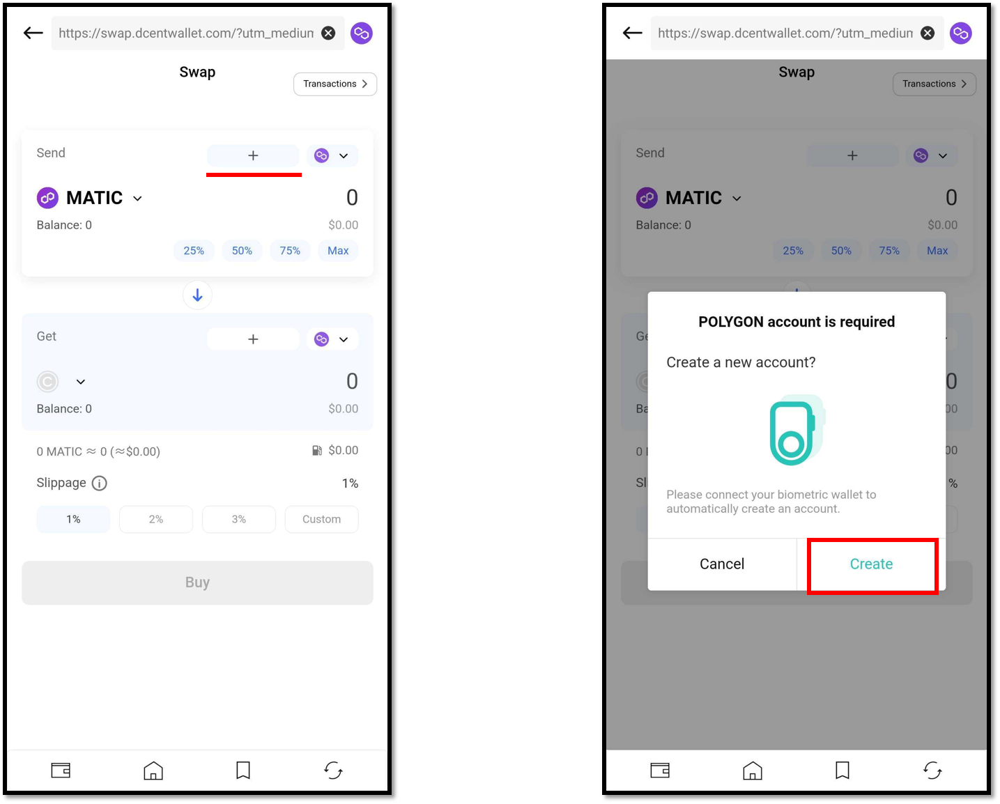
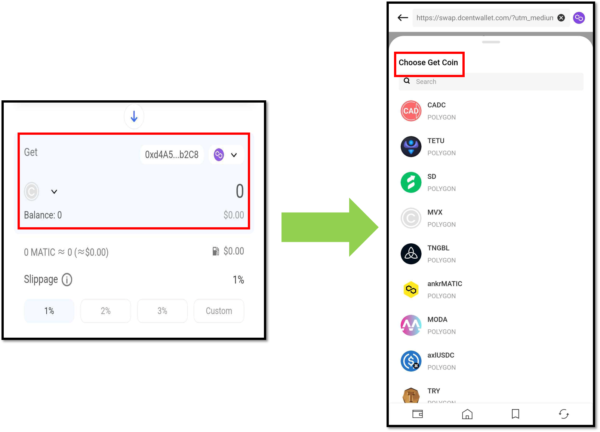
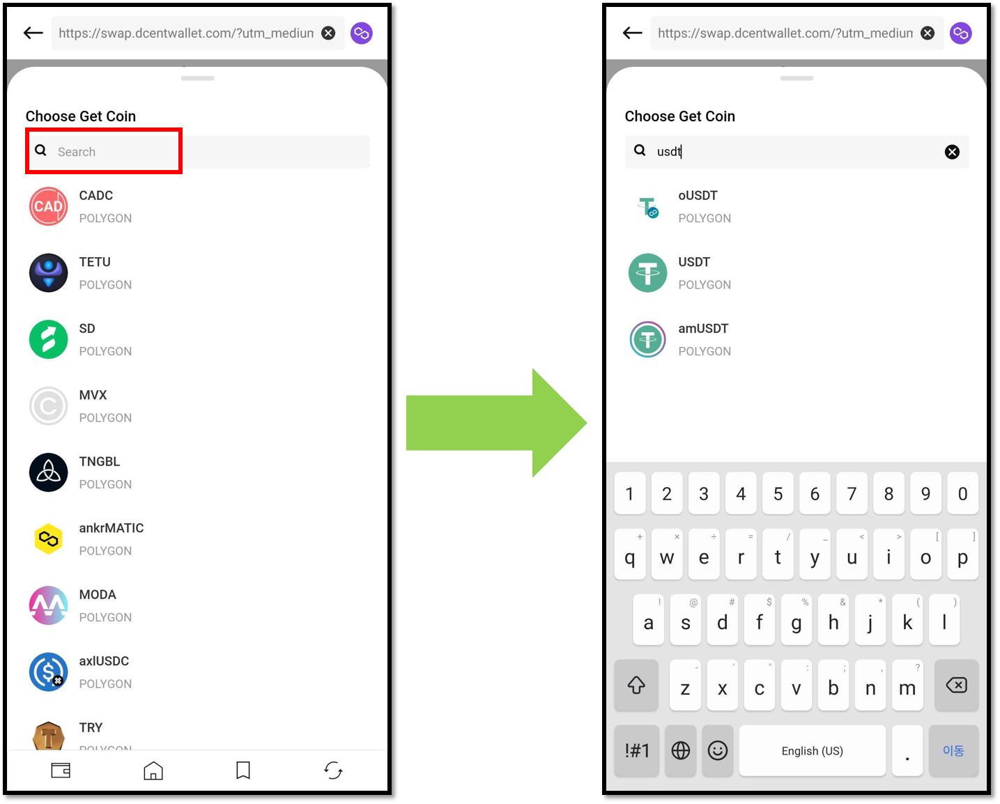
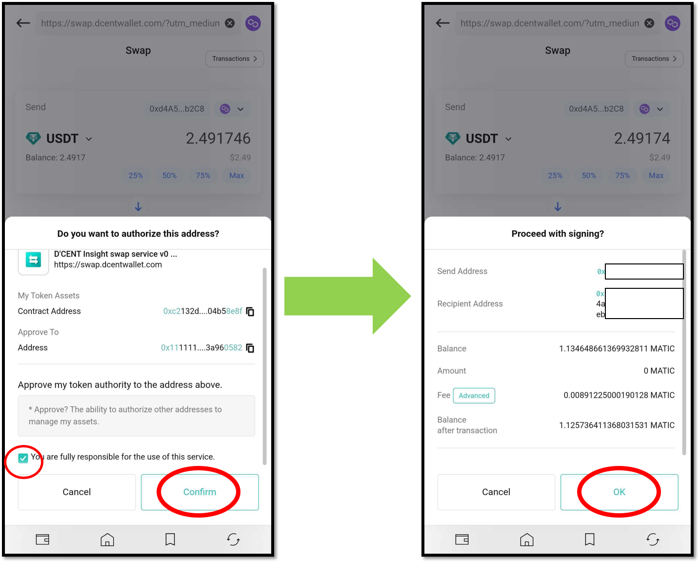

# Swap

Swap is a service that allows you to easily and quickly exchange your cryptocurrency for another one.

D'CENT Wallet provides SWAP service through 1inch DEX, an aggregator that provides be the rate for swapping ERC20 tokens issued on the same network.


Swap service is available for D'CENT App version **5.16.0 or higher**.


## Access the Swap serive 

**1)** You can access the Swap service in the D'CENT app at the top of the **"My Wallet"** tab or in the **"Discovery"** tab.

<figure><figcaption></figcaption></figure>

**2)** When you access the swap service, the connected main network information, wallet address, and balance of your cryptocurrency will be displayed.

**3)** To change the main network, you can touch the More button to change to the wanted network, as shown below.

<figure><figcaption></figcaption></figure>

**4)** When the Select Network popup appears, available main networks will be displayed. Availability of networks listed on D’CENT Wallet may change based on the service provider’s conditions. Swipe up the screen to select the network you want to use.

<figure><figcaption></figcaption></figure>

If account from the selected network does not exist, you can create it to your D'CENT wallet by pressing the **+ button** as shown below.


If you are biometric wallet user, hardware wallet must be connected.


<figure><figcaption></figcaption></figure>

## **Start Swapping**

**1)** Choose the cryptocurrency to be swapped.  **Send** is the cryptocurrency you have, and you can choose the coin to be swapped by pressing the More button.

Choose the cryptocurrency coin you have.

<figure><figcaption></figcaption></figure>

**2)** If you choose a coin in Send, choose the coin you want to receive by swap in **Get**.

<figure><figcaption></figcaption></figure>

You can also use the search bar to find the coin you are looking for.

<figure><figcaption></figcaption></figure>

**3)** When you have selected the cryptocurrency coins you want to receive, enter the quantity of tokens you want to swap in **Send**. You can enter a coin amount directly in **Ⓐ** and choose a percentage of your balance in **Ⓑ**.

When you have completed entering the amount, you can see the amount of coins to receive in **Ⓒ** of the **Get** and the estimated fee (gas fee) in **Ⓓ**.

**4)** After you have an estimate of the amount coins you will received, you can set the value of slippage.

The phenomenon in which the price fluctuates between the time of ordering and the time of confirmation is called "Slippage", and default slippage values of 1%. \
In addition to the recommended slippage values of 1%, 2%, and 3%, you can set the slippage value to a higher value. The maximum slippage that can be set is capped to 49%.

After you have finished setting the value of the slippage in **Ⓐ**, press the **"Buy"** button in **Ⓑ**.

**5)**  You will see the following screen shortly. Confirm the contract address, and then proceed with signing. Once authorization is done, **the token will no longer need authorization again.**

<figure><figcaption></figcaption></figure>

**6)** After authorization, you will see the final quotation.

After reviewing the final quotation and checking that everything is in order, click the **"Confirm"** button by checking the **"I have checked the cautions"** box. Afterward, double-check that the signed information is correct and click the **"OK"** button.

**7)** After confirming the final signing information, proceed to sign the transaction in your wallet and the swap request transaction will be completed and you will be able to see the estimated amount of coins you will received.

At this time, when you press the **"Where can I check my transaction history?"** button, the following pop-up appears, and you can press the **"View transaction history"** button to check the history.\
Of course, you can check the transaction information with Block Explorer by pressing a button like **"Polygon Scan".**

**8)** If the cryptocurrency account you wanted to swap is not added to D'CENT, you can add it right away, as shown below. Now you can see the swapped cryptocurrency balance through the **"My Wallet"** tab.

