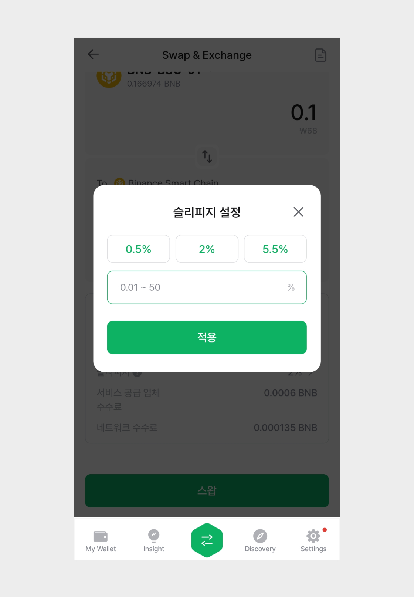
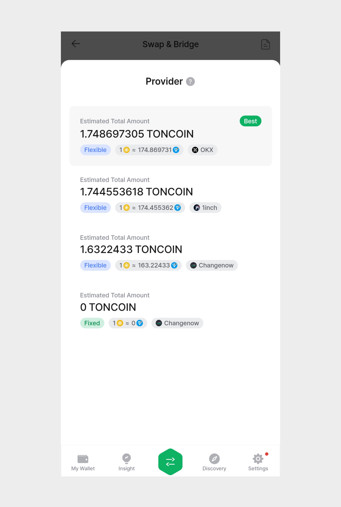
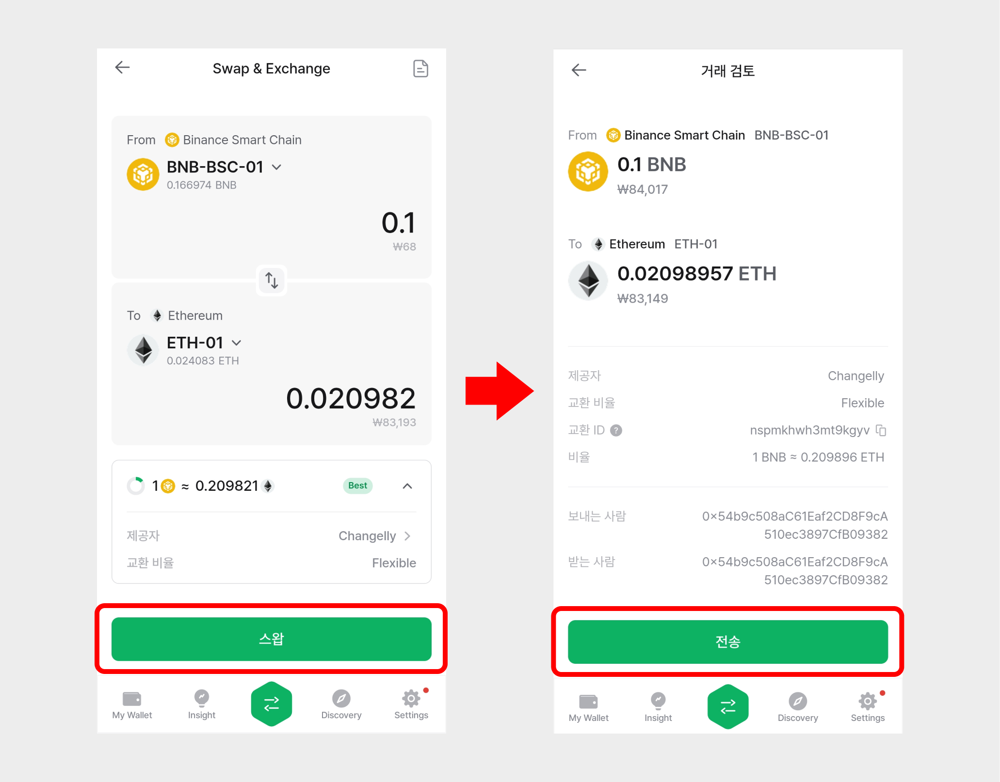
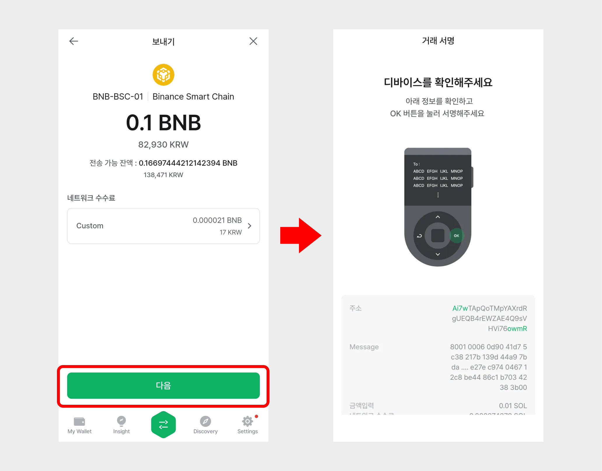

# 스왑 (Swap)

스왑(Swap)은 내가 가진 암호화폐를 다른 암호화폐로 빠르고 쉽게 교환할 수 있는 기능입니다.

디센트 지갑의 스왑(Swap) 서비스는 다양한 블록체인에서 암호화폐를 간편하게 교환할 수 있도록 도와줍니다. 이를 위해 1inch, OKX, ChangeNOW, Changelly와 같은 애그리게이터를 활용하고 있습니다.

디센트 스왑의 장점은 **브릿지, 크로스체인 스왑, 스왑을 모두 한 화면에서 편리하게 이용**할 수 있다는 점입니다. 예를 들어, 이더리움 네트워크의 USDT를 폴리곤 네트워크의 USDT로 바꿀 수 있습니다.


해당 서비스를 이용하기 위해서는 **7.4.0 이상의 앱버전**이 필요합니다.


## 스왑 서비스 접속 

**1)** 스왑 서비스는 아래 네 가지 방법으로 접속할 수 있습니다.

* **①** 디센트 앱 → \[**My Wallet] 탭** 상단의 **‘스왑’ 버튼** 클릭
* **②** 디센트 앱 → \[**My Wallet] 탭의 추가한 코인 계정 클릭** → **‘스왑’ 버튼** 클릭
* **③** 디센트 앱 → 하단 **GNB 영역**의 **‘스왑’ 아이콘** 클릭
* **④** 디센트 앱 → **\[Insight] 탭의 코인별 상세 화면** → **‘스왑’ 버튼** 클릭

<figure><figcaption></figcaption></figure>

**2)** 스왑 서비스에 접속하면 **From(보내는 토큰)** 과 **To(받는 토큰)**&#xC744; 선택할 수 있는 화면이 뜹니다.

<figure><figcaption></figcaption></figure>

**3)** From (보내는 토큰)에는 **연결된 메인 네트워크 정보와 토큰 계정 이름, 해당 계정에서 보유하고 있는 토큰의 수량**이 표시됩니다.

보내는 토큰을 변경 하려면 아래 그림과 같이 **토큰 계정 이름**을 눌러 원하는 토큰을 검색하거나 목록에서 선택할 수 있습니다.

<figure><figcaption></figcaption></figure>


보내는 토큰 팝업에서는 지갑에 추가되어있는 토큰 계정만 선택할 수 있습니다.


**4)** To (받는 토큰) 에서도 토큰 계정 이름을 누르면 누르면 토큰을 선택할 수 있는 팝업이 뜹니다.

만약 지갑에 추가 되어있는 토큰이 아닌 새로운 토큰을 선택하고 싶다면, ‘더보기’를 눌러 새로운 네트워크를 선택하거나 검색창에 토큰 이름을 입력해 선택할 수 있습니다.

<figure><figcaption></figcaption></figure>

새로운 토큰을 선택 했다면, ‘계정 추가’ 버튼을 눌러 네트워크 수수료를 지불할 계정을 선택하고 계정 이름을 입력한 후 ‘만들기’ 버튼을 누르면 해당 토큰 계정이 새로 추가 됩니다.

<figure><figcaption></figcaption></figure>

## **토큰 스왑 진행하기**  

**1)** From(보내는 토큰) 과 To(받는 토큰) 에서 스왑을 진행할 토큰을 선택합니다. From 에서 **스왑할 토큰의 수량을 입력**해주세요.


To(받는 토큰) 에서 선택한 토큰 별로 보내는 토큰의 최소 수량이 존재합니다. 안내 되는 최소 수량을 확인해주세요.


<figure><figcaption></figcaption></figure>

**2)** **From** 에서 보내는 수량을 입력하였다면 To 에서 받는 토큰 수량과 금액을 확인할 수 있습니다.

지원되는 유동성 제공자 중 더 좋은 가격을 제공하는 스왑 비율과 추천 제공자를 확인할 수 있습니다.

<figure><figcaption></figcaption></figure>


스왑에 필요한 수수료는 OKX, 1 inch 와 같은 서비스 공급 업체의 수수료와 블록체인 상에서 거래를 수행하기 위한 네트워크 수수료(가스비) 입니다. 디센트는 스왑 서비스를 통해 사용자에게 별도의 수수료를 부과하지 않습니다.


**3)** 선택된 견적이 탈중앙화 거래소 제공자를 통한 거래인 경우, 하단부에서 **‘슬리피지’** 정보를 확인할 수 있습니다.

슬리피지는 **"주문 시점의 예상 가격과 실제 거래가 완료된 가격 의 차이”** 를 말합니다. 슬리피지는 일반적으로 변동성이 크거나 유동상이 낮은 시장에서 발생합니다. 기본적으로 거래에 최적화된 슬리피지가 추천되어 표시됩니다.

슬리피지는 사용자가 직접 설정할 수 있습니다. 슬리피지 설정값으로 선택할 수 있는 0.5%, 2%, 5.5% 외에도 최소 0.01% \~ 최대 50% 사이에서 직접 값을 설정할 수 있습니다.

<figure><figcaption></figcaption></figure>


밈코인 거래시 슬리피지를 높여야 체결이 완료될 확률이 높습니다. 또한 이전 거래에서 실패 했을 경우 슬리피지를 높이면 거래 체결이 완료될 확률이 높습니다.


**4)** 선택한 견적이 중앙화된 거래소 제공자를 통한 거래일 경우 **‘교환 비율’** 정보를 확인할 수 있습니다. 이때 교환비 옵션은 ‘Flexible(변동)’과 ‘Fixed(고정)’ 으로 나뉩니다.

<figure><figcaption></figcaption></figure>

**5)** 견적을 모두 확인하였으면 아래 **“스왑” 버튼**을 누릅니다. 거래를 검토한 후 "확인" 또는 "전송" 버튼을 누릅니다.&#x20;

<figure><figcaption></figcaption></figure>


거래가 지연되거나 실패한 경우 거래 검토 화면에 표시된 **‘교환 ID’**&#xB97C; 통해 거래소에 문의하실 수 있습니다.&#x20;

**‘교환 ID’ 확인**은 ‘거래 검토’ 화면 또는 스왑 메인 화면에서 우측 아이콘을 눌러 ‘스왑 내역’ > '스왑 상세' 화면에서 확인 할 수 있습니다.


<figure><figcaption>
교환 ID 옆 '진행 상황 확인' 버튼을 누르면 상세하게 확인할 수 있습니다.
</figcaption></figure>

**6)** 이후 보내는 토큰 수량과 금액, 받는 토큰의 수량, 네트워크 수수료 등을 다시 한번 확인을 한 후 "다음" 또는"보내기" 버튼을 누릅니다. 최종 서명 정보를 확인한 후 지갑에서 거래의 서명을 진행하면 스왑 요청이 완료됩니다.

<figure><figcaption></figcaption></figure>


일부 스왑의 경우, 중앙화 거래소에 토큰을 전송해야 하므로 보내기 트랜잭션에 거래 서명이 필요 합니다.


이때 **"내역 보기" 버튼**을 누르면 스왑 내역을 확인할 수 있습니다.

<figure><figcaption></figcaption></figure>

스왑이 완료 되면 스왑 상세 화면에서 **TXID 를 클릭하면** 실제 트랜잭션 정보를 Block Explorer로 확인할 수 있습니다.

**7)** 이제 "My Wallet" 탭을 통해 스왑된 암호화폐를 확인할 수 있습니다.

<figure><figcaption></figcaption></figure>


서비스 이용에 관한 문의사항은 먼저 아래 고객센터에서 답변을 확인해주시기 바랍니다.

* [ChangeNow](https://support.changenow.io/hc/en-us)&#x20;
* [Changelly](https://support.changelly.com/en/support/home)
* [1inch](https://help.1inch.io/en/)
* [OKX Swap / Cross Chain](https://www.okx.com/help)



디센트 지갑은 외부 서비스(dApp)를 연결해주는 역할(스왑할 수 있는 직관적인 화면을 제공)만 하며, 해당 서비스에서 발생할 수 있는 위험에 직접적인 책임을 지지 않는다는 점을 유의해 주세요.


