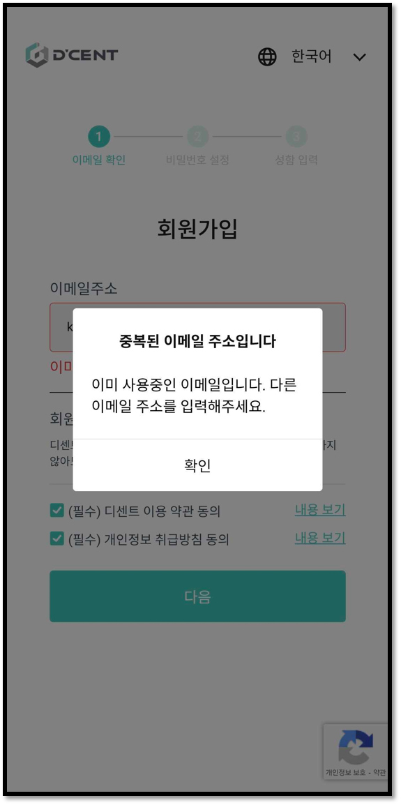

# 이메일 인증 오류 시 확인해야 할 점


**디센트 이메일 인증기능 가입을 하지 않더라도 디센트 서비스를 이용하실 수 있습니다**.


회원가입 이후 이메일 인증에서 문제가 발생하는 경우 아래와 같이 시도해보시기 바랍니다.

1\. [https://portal.dcentwallet.com/](https://portal.dcentwallet.com/) 에서 회원가입이 되어 있는지 확인하기

2\. 회원가입이 된 상태라면, 중복된 이메일이라고 안내 메세지가 뜹니다.

3\. 회원가입이 되어 있지 않다면 비밀번호 입력 화면으로 넘어가게 됩니다.

4\. 회원가입이 되지 않은 상황이라면 회원 가입을 시도하면 됩니다.

5\. 회원가입이 되어 있는 상황이라면 비밀번호 변경을 시도해보세요.
