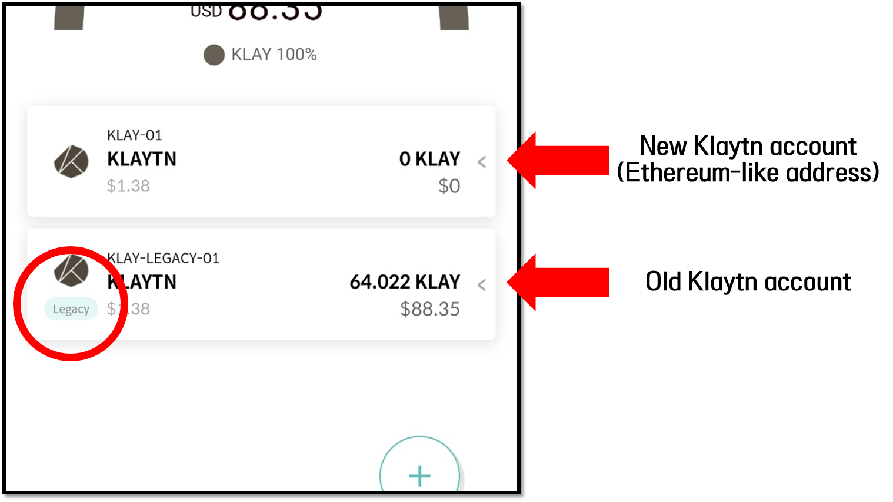

# Notes on Wallet Recovery - Legacy account

When you have recovered your wallet using the mnemonic code (24 words), you have only recovered the Master Key of the wallet. At this point, there are no private keys created for the cryptocurrency accounts that you have created before. To manage these cryptocurrency accounts again, just re-add the accounts in the D'CENT App.&#x20;

## Changes affecting D'CENT Biometric Wallet (**v2.9.2 or higher**) and App Wallet (**v5.3.1 or higher**)&#x20;

**Legacy** account and **Standard** account for **Klaytn, Ethereum Classic, and RSK** have been added.

A Standard account is a new address format for creating an account(Klaytn, ETC, or RSK) that has the same address as that of the Ethereum account. This is a completely different account from the Legacy account that you have previously created before this update.

### What is a Legacy account?

A legacy account is a cryptocurrency account that was created by the user before the update (firmware(**v2.9.2**) or App Wallet(**v5.3.1**)).

A legacy account will be marked with a label icon "**Legacy**" on the account. Below is an example of what a Legacy account looks like.

If you have previously created **Klaytn, ETC, or RSK **in your D'CENT Wallet before this update (firmware(**v2.9.2**) or App Wallet(**v5.3.1**)), and if you have just recovered your wallet, you will have to **add the Legacy account** in the D'CENT App to see your account balance again.


If you have mistakenly added a standard account instead of the legacy account, you can just '**Hide**' the standard account to remove it from the D'CENT App. This is important because if you are using the Discovery Tab(Dapp browser), the first account that is created in the D'CENT wallet is the one that connects to a visiting dapp service.


