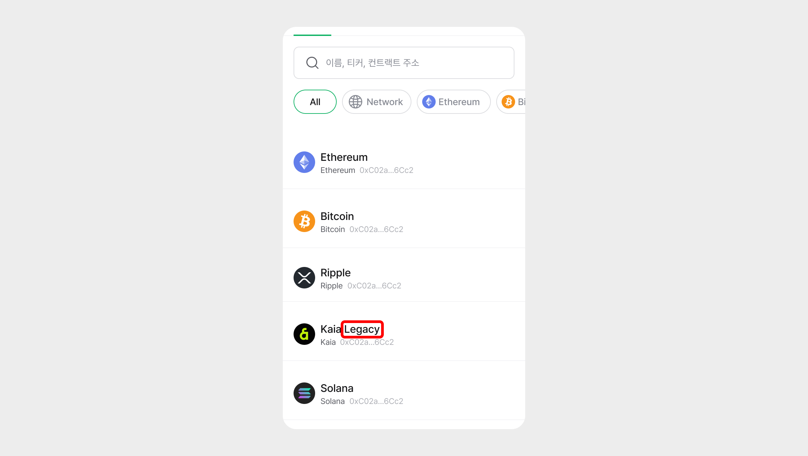

# 지갑 복구 주의 사항 - 레거시 계정 주소

모바일 앱 버전 v5.3.1 업데이트에서 Kaia(카이아), Ethereum Classic(이더리움 클래식), RSK(루트스탁) 계정을 생성할 경우 이더리움 주소와 동일한 주소를 가진 계정이 생성되도록 변경되었습니다.&#x20;

.jpg>)

따라서 모바일 앱 업데이트 이전부터 디센트 앱 지갑 또는 지문인증형 지갑을 사용하셨다면, **지갑 복구 이후에 "Legacy" 계정을 생성해야 기존 자산을 확인하실 수 있습니다.**

.jpg>)

### "Legacy" 계정을 추가하는 방법은 아래와 같습니다.

&#x20; 1\) 지금 생성된 새 계정 이름에 Legacy가 없다면 구(Legacy)계정 추가를 진행합니다.

&#x20; 2\) 계정 추가 버튼(+)을 눌러 리스트에서 "Legacy"로 표시된 계정을 선택합니다. e.g) Kaia Legacy

&#x20; 3\) 생성 완료 이후 “Legacy” 이름이 붙은 계정이 생성되고 기존에 가지고 계시던 자산을 확인합니다.

&#x20; 4\) "Legacy"가 표시되지 않은 계정은 새 계정은 "계정 숨기기" 버튼을 클릭하여 계정을 삭제해 주세요.
